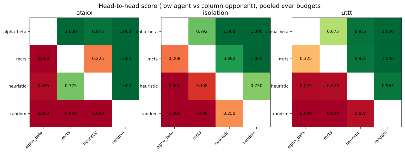
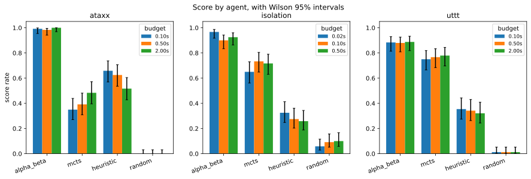
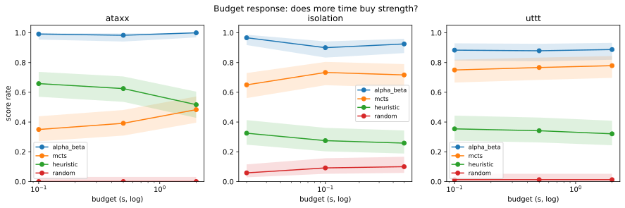

# Tournament report: v1-tournament

## 1. Overview

| property | value |
|---|---|
| games played | 2160 |
| games | ataxx, isolation, uttt |
| configs | easy, hard, main |
| agents | alpha_beta, mcts, heuristic, random |
| error moves | 0 |

**Run time: 7.94 h of search** (summed from every move's `elapsed_s`, so it is derived from the data, not from an external clock), against **7.93 h wall clock**


This is the **v1 tournament**: the full grid of 3 games x 4 agents x 3 time
budgets x 20 trials, played in both seat orders, 2160 games in 7 h 56 m on a
dedicated idle VM.

It exists to answer one question: **how do exact tree search and sampling-based
search compare as state-space size and branching factor grow, when both are held
to the same wall-clock per-move budget?** The three games are chosen to separate
those two axes - Ataxx is the *middle* game by state space but by far the widest,
so any effect that tracks branching rather than state-space size shows up as a
disagreement between the two orderings.

**Zero error moves and zero excluded games.** No agent produced an illegal move
or crashed in 2160 games, so every number below is computed over the complete
grid rather than a filtered subset.

## 2. Method for this run

| game | config | budget (s) |
|---|---|---|
| ataxx | hard | 0.1 |
| ataxx | main | 0.5 |
| ataxx | easy | 2.0 |
| isolation | hard | 0.02 |
| isolation | main | 0.1 |
| isolation | easy | 0.5 |
| uttt | hard | 0.1 |
| uttt | main | 0.5 |
| uttt | easy | 2.0 |

> These values are **reconstructed**, not recorded by the run itself. The tournament does not yet write its own metadata.

| property | value |
|---|---|
| caps | max_entries=200000, max_nodes=50000 |
| mcts_rollout | epsilon=1.0, rollout_depth=10, sample_k=1 |
| note | Reconstructed after the fact. The tournament does not write run metadata; see the V2 improvement list. |
| platform | Ubuntu 22.04, Multipass guest, 4 vCPU / 4 GB |
| python | 3.10.12 |
| restarts | 0 |
| tag | v1-tournament |
| wall_clock | 7h56m |
| wall_clock_source | reconstructed from the run's own log; this run predates record_run_finished() |

**Host** - the budget is wall clock, so results are only comparable against the same machine

| property | value |
|---|---|
| CPU | 13th Gen Intel(R) Core(TM) i7-1365U |
| vCPU | 4 |
| RAM (GB) | 3.82 |
| Disk (GB) | 19.2 |
| OS | Ubuntu 22.04.5 LTS |
| Kernel | Linux-5.15.0-186-generic-x86_64-with-glibc2.35 |
| Architecture | x86_64 |
| Virtualisation | microsoft |

Read the budget table carefully: **`easy` means *more* time, `hard` means less.**
The names describe difficulty for the agent, not size of budget, and they are easy
to read backwards.

Two design choices matter for interpreting everything downstream. Every pairing is
played in **both seat orders**, so first-move advantage cannot accrue to one agent;
and trials are **interleaved across matchups** rather than run in blocks, so thermal
drift or a noisy neighbour reaches all agents equally instead of accumulating
against whichever ran last.

**The run metadata above is reconstructed, and that is a real weakness.** The MCTS
rollout parameters are not recorded anywhere in the CSVs - they live only as a
constant in `experiments/tournament.py`. This is precisely the parameter whose
silent default caused defect D4 (the tournament ignored calibration entirely) and
whose correction forced the rewrite of finding F3. A reader cannot verify from the
data alone which configuration produced these results; they must trust the tag.
**The first V2 change should be for the tournament to write its own metadata at
startup.**

## 3. Results


**ataxx** - head-to-head, pooled over budgets (row agent vs column opponent)

|  | alpha_beta | mcts | heuristic | random |
|---|---|---|---|---|
| alpha_beta | - | 1.000 | 0.975 | 1.000 |
| mcts | 0.000 | - | 0.225 | 1.000 |
| heuristic | 0.025 | 0.775 | - | 1.000 |
| random | 0.000 | 0.000 | 0.000 | - |

**isolation** - head-to-head, pooled over budgets (row agent vs column opponent)

|  | alpha_beta | mcts | heuristic | random |
|---|---|---|---|---|
| alpha_beta | - | 0.792 | 1.000 | 1.000 |
| mcts | 0.208 | - | 0.892 | 1.000 |
| heuristic | 0.000 | 0.108 | - | 0.750 |
| random | 0.000 | 0.000 | 0.250 | - |

**uttt** - head-to-head, pooled over budgets (row agent vs column opponent)

|  | alpha_beta | mcts | heuristic | random |
|---|---|---|---|---|
| alpha_beta | - | 0.675 | 0.975 | 1.000 |
| mcts | 0.325 | - | 0.971 | 1.000 |
| heuristic | 0.025 | 0.029 | - | 0.963 |
| random | 0.000 | 0.000 | 0.037 | - |







**Non-transitivity check** - each pairing once, pooled over budgets. The reverse direction is the complement: score `1 - s`, record reversed.

| game | agent | opponent | score | W-D-L |
|---|---|---|---|---|
| ataxx | alpha_beta | heuristic | 0.975 | 117-0-3 |
| ataxx | alpha_beta | mcts | 1.000 | 120-0-0 |
| ataxx | alpha_beta | random | 1.000 | 120-0-0 |
| ataxx | heuristic | random | 1.000 | 120-0-0 |
| ataxx | mcts | heuristic | 0.225 | 27-0-93 |
| ataxx | mcts | random | 1.000 | 120-0-0 |
| isolation | alpha_beta | heuristic | 1.000 | 120-0-0 |
| isolation | alpha_beta | mcts | 0.792 | 95-0-25 |
| isolation | alpha_beta | random | 1.000 | 120-0-0 |
| isolation | heuristic | random | 0.750 | 90-0-30 |
| isolation | mcts | heuristic | 0.892 | 107-0-13 |
| isolation | mcts | random | 1.000 | 120-0-0 |
| uttt | alpha_beta | heuristic | 0.975 | 115-4-1 |
| uttt | alpha_beta | mcts | 0.675 | 65-32-23 |
| uttt | alpha_beta | random | 1.000 | 120-0-0 |
| uttt | heuristic | random | 0.963 | 114-3-3 |
| uttt | mcts | heuristic | 0.971 | 115-3-2 |
| uttt | mcts | random | 1.000 | 120-0-0 |

-> Full per-config breakdown: [E1](#e1-full-head-to-head). Full score table: [E2](#e2-full-score-table).


**Alpha-Beta wins every cell**, from 0.879 to 1.000. That much is not surprising and
is not the finding.

The finding is in **second place, and it inverts by game**:

| | MCTS vs heuristic |
|---|---|
| Isolation (branching ~6) | **0.892** - MCTS dominates |
| UTTT (branching ~9) | **0.971** - MCTS dominates |
| Ataxx (branching ~25-51) | **0.225** - MCTS is beaten |

MCTS beats a one-ply evaluator comfortably on the two narrow games and loses to it
badly on the wide one. The ordering flips exactly where branching factor jumps, not
where state-space size does - Ataxx is the *middle* game by state space and the
worst for MCTS. **Width, not state-space size, is what defeats sampling-based
search.** This is the study's central result and it is only visible head-to-head;
the field score conflates it with results against the random agent.

The non-transitivity table shows the margins are wildly non-uniform. On Ataxx,
MCTS scores **1.000 against the random agent and 0.225 against the heuristic**.
That pairing is the cleanest evidence available that MCTS is **beaten rather than
broken**: an implementation defect would not produce a perfect record against one
opponent and a poor one against another in the same cell.

Note also that Alpha-Beta's margin over MCTS is itself game-dependent - 0.675 on
UTTT against 1.000 on Ataxx. MCTS is competitive with exact search on the narrow
games and not remotely competitive on the wide one.

## 4. Budget response


**ataxx / alpha_beta**

| budget (s) | config | score | games |
|---|---|---|---|
| 0.1 | hard | 0.992 [0.954-0.999] | 120 |
| 0.5 | main | 0.983 [0.941-0.995] | 120 |
| 2.0 | easy | 1.000 [0.969-1.000] | 120 |

**ataxx / heuristic**

| budget (s) | config | score | games |
|---|---|---|---|
| 0.1 | hard | 0.658 [0.570-0.737] | 120 |
| 0.5 | main | 0.625 [0.536-0.706] | 120 |
| 2.0 | easy | 0.517 [0.428-0.604] | 120 |

**ataxx / mcts**

| budget (s) | config | score | games |
|---|---|---|---|
| 0.1 | hard | 0.350 [0.271-0.439] | 120 |
| 0.5 | main | 0.392 [0.309-0.481] | 120 |
| 2.0 | easy | 0.483 [0.396-0.572] | 120 |

**ataxx / random**

| budget (s) | config | score | games |
|---|---|---|---|
| 0.1 | hard | 0.000 [0.000-0.031] | 120 |
| 0.5 | main | 0.000 [0.000-0.031] | 120 |
| 2.0 | easy | 0.000 [0.000-0.031] | 120 |

**isolation / alpha_beta**

| budget (s) | config | score | games |
|---|---|---|---|
| 0.02 | hard | 0.967 [0.917-0.987] | 120 |
| 0.1 | main | 0.900 [0.833-0.942] | 120 |
| 0.5 | easy | 0.925 [0.864-0.960] | 120 |

**isolation / heuristic**

| budget (s) | config | score | games |
|---|---|---|---|
| 0.02 | hard | 0.325 [0.248-0.413] | 120 |
| 0.1 | main | 0.275 [0.203-0.361] | 120 |
| 0.5 | easy | 0.258 [0.188-0.343] | 120 |

**isolation / mcts**

| budget (s) | config | score | games |
|---|---|---|---|
| 0.02 | hard | 0.650 [0.561-0.729] | 120 |
| 0.1 | main | 0.733 [0.648-0.804] | 120 |
| 0.5 | easy | 0.717 [0.630-0.790] | 120 |

**isolation / random**

| budget (s) | config | score | games |
|---|---|---|---|
| 0.02 | hard | 0.058 [0.029-0.116] | 120 |
| 0.1 | main | 0.092 [0.052-0.157] | 120 |
| 0.5 | easy | 0.100 [0.058-0.167] | 120 |

**uttt / alpha_beta**

| budget (s) | config | score | games |
|---|---|---|---|
| 0.1 | hard | 0.883 [0.814-0.929] | 120 |
| 0.5 | main | 0.879 [0.809-0.926] | 120 |
| 2.0 | easy | 0.887 [0.819-0.932] | 120 |

**uttt / heuristic**

| budget (s) | config | score | games |
|---|---|---|---|
| 0.1 | hard | 0.354 [0.274-0.443] | 120 |
| 0.5 | main | 0.342 [0.263-0.430] | 120 |
| 2.0 | easy | 0.321 [0.244-0.409] | 120 |

**uttt / mcts**

| budget (s) | config | score | games |
|---|---|---|---|
| 0.1 | hard | 0.750 [0.666-0.819] | 120 |
| 0.5 | main | 0.767 [0.683-0.833] | 120 |
| 2.0 | easy | 0.779 [0.697-0.844] | 120 |

**uttt / random**

| budget (s) | config | score | games |
|---|---|---|---|
| 0.1 | hard | 0.013 [0.003-0.052] | 120 |
| 0.5 | main | 0.013 [0.003-0.052] | 120 |
| 2.0 | easy | 0.013 [0.003-0.052] | 120 |




Three different shapes here, and each says something distinct.

**Alpha-Beta is flat.** On UTTT a 20x budget increase moves it 0.883 -> 0.879 ->
0.887 - i.e. not at all. On Isolation it is flat or slightly *negative*. It has
already saturated: extra time buys depth it does not need, because it has solved
or near-solved the position at the smallest budget. This is what makes Isolation a
**control** rather than a degradation datapoint.

**MCTS is the only agent that converts time into strength**, and only on Ataxx:
0.350 -> 0.392 -> **0.483** across a 20x increase, still climbing at the largest
budget. Head to head against the heuristic the same trend is sharper - 0.050 ->
0.175 -> 0.450, reaching statistical parity at 2.0 s. MCTS is not stuck; it is
**under-resourced for the width**, and the budget it would need is well beyond
anything affordable in this grid.

**The heuristic appears to get *worse* with more time** on Ataxx, 0.658 -> 0.625 ->
0.517. It is a one-ply agent and consumes essentially none of the budget (see
instrument validation), so nothing about it changed. Its score falls because its
*opponents* improve. This is a useful warning about field scores: a curve can move
because of agents it is not about.

## 5. Search volume and viability

| game | config | agent | mean sims | median /root | p5 /root | % below floor | verdict |
|---|---|---|---|---|---|---|---|
| ataxx | easy | mcts | 17916.8 | 347.6 | 122.1 | 0.0% | ample |
| ataxx | hard | mcts | 410.6 | 23.5 | 3.9 | 20.1% | viable |
| ataxx | main | mcts | 3142.1 | 90.3 | 36.9 | 0.0% | ample |
| isolation | easy | mcts | 92519.9 | 11705.6 | 1183.7 | 0.0% | ample |
| isolation | hard | mcts | 3150.3 | 258.6 | 49.1 | 0.0% | ample |
| isolation | main | mcts | 16776.0 | 1612.7 | 245.2 | 0.0% | ample |
| uttt | easy | mcts | 56875.1 | 1972.4 | 450.1 | 0.0% | ample |
| uttt | hard | mcts | 1621.9 | 96.6 | 20.5 | 2.5% | ample |
| uttt | main | mcts | 12197.9 | 485.3 | 91.3 | 0.0% | ample |

**Alpha-Beta depth reached**

| game | config | agent | median depth | max depth |
|---|---|---|---|---|
| ataxx | easy | alpha_beta | 4.0 | 9 |
| ataxx | hard | alpha_beta | 3.0 | 6 |
| ataxx | main | alpha_beta | 4.0 | 7 |
| isolation | easy | alpha_beta | 6.0 | 18 |
| isolation | hard | alpha_beta | 5.0 | 14 |
| isolation | main | alpha_beta | 7.0 | 15 |
| uttt | easy | alpha_beta | 7.0 | 64 |
| uttt | hard | alpha_beta | 5.0 | 64 |
| uttt | main | alpha_beta | 6.0 | 64 |


This table exists because of defect D9, and the reason is worth stating plainly.
The figure reported here was previously computed as the **mean** of each decision's
simulations-per-legal-move ratio. A position with one legal move contributes a ratio
equal to the entire simulation count, and 10-14% of Ataxx MCTS decisions have exactly
one legal move - so the number was inflated 4-8x by positions where no choice was
made at all. The headline is now the **median**, with the low tail beside it.

**"Ample" is a floor, not a sufficiency criterion.** Ataxx at 0.5 s clears the
`>= 30` threshold comfortably at 90.3 simulations per root move, and still scores
0.175 against a one-ply evaluator. Clearing the floor buys the ability to try each
candidate once; it does not buy competitive play at width 25-30. Any reading of
these results as "MCTS did not get to search" is wrong: **no decision anywhere in
the run fell below one simulation per root move.**

The one genuinely thin cell is **Ataxx-hard**, where 20.1% of decisions fall below
the viability floor and the 5th percentile is 3.9. That is why the p5 and
%-below-floor columns are reported: a single median of 23.5 would have hidden a
fifth of the decisions being starved.

Alpha-Beta's depth tells the same story from the other side: median depth **3-4 on
Ataxx** against 5-7 on Isolation and UTTT. Both paradigms are squeezed by width;
they just fail differently.

## 6. Instrument validation


**Budget compliance** (elapsed / budget)

| game | config | agent | mean | p99 | max | moves |
|---|---|---|---|---|---|---|
| ataxx | easy | alpha_beta | 92.0% | 100.0% | 102.9% | 3167 |
| ataxx | easy | heuristic | 0.0% | 0.0% | 0.9% | 3044 |
| ataxx | easy | mcts | 100.0% | 100.5% | 105.6% | 3178 |
| ataxx | easy | random | 0.0% | 0.0% | 0.0% | 630 |
| ataxx | hard | alpha_beta | 93.0% | 100.5% | 106.0% | 2449 |
| ataxx | hard | heuristic | 0.3% | 1.0% | 2.0% | 2484 |
| ataxx | hard | mcts | 100.1% | 101.8% | 114.2% | 2171 |
| ataxx | hard | random | 0.0% | 0.0% | 0.0% | 978 |
| ataxx | main | alpha_beta | 92.4% | 100.1% | 103.1% | 3024 |
| ataxx | main | heuristic | 0.1% | 0.2% | 0.3% | 3127 |
| ataxx | main | mcts | 100.0% | 100.1% | 106.3% | 3162 |
| ataxx | main | random | 0.0% | 0.0% | 0.0% | 652 |
| isolation | easy | alpha_beta | 34.2% | 100.1% | 102.3% | 769 |
| isolation | easy | heuristic | 0.0% | 0.0% | 0.0% | 871 |
| isolation | easy | mcts | 100.0% | 100.2% | 103.6% | 899 |
| isolation | easy | random | 0.0% | 0.0% | 0.0% | 749 |
| isolation | hard | alpha_beta | 52.9% | 104.0% | 138.7% | 767 |
| isolation | hard | heuristic | 0.1% | 0.4% | 2.4% | 868 |
| isolation | hard | mcts | 100.1% | 101.4% | 116.3% | 889 |
| isolation | hard | random | 0.0% | 0.1% | 0.2% | 745 |
| isolation | main | alpha_beta | 45.3% | 105.2% | 128.3% | 785 |
| isolation | main | heuristic | 0.0% | 0.1% | 0.4% | 858 |
| isolation | main | mcts | 100.1% | 101.5% | 112.4% | 891 |
| isolation | main | random | 0.0% | 0.0% | 0.4% | 759 |
| uttt | easy | alpha_beta | 90.4% | 100.1% | 102.9% | 2502 |
| uttt | easy | heuristic | 0.0% | 0.3% | 0.4% | 2131 |
| uttt | easy | mcts | 100.0% | 100.0% | 101.6% | 2450 |
| uttt | easy | random | 0.0% | 0.0% | 0.0% | 2203 |
| uttt | hard | alpha_beta | 93.2% | 101.2% | 115.4% | 2497 |
| uttt | hard | heuristic | 0.8% | 6.0% | 8.0% | 2245 |
| uttt | hard | mcts | 100.1% | 100.3% | 110.6% | 2379 |
| uttt | hard | random | 0.0% | 0.0% | 0.0% | 2292 |
| uttt | main | alpha_beta | 91.4% | 100.3% | 103.0% | 2480 |
| uttt | main | heuristic | 0.2% | 1.2% | 2.3% | 2168 |
| uttt | main | mcts | 100.0% | 100.1% | 104.0% | 2408 |
| uttt | main | random | 0.0% | 0.0% | 0.0% | 2202 |

**Every agent against the random agent** - a one-ply evaluator should dominate here; a weak control game shows up as a low score

| game | agent | score | W-D-L |
|---|---|---|---|
| ataxx | alpha_beta | 1.000 | 120-0-0 |
| ataxx | heuristic | 1.000 | 120-0-0 |
| ataxx | mcts | 1.000 | 120-0-0 |
| isolation | alpha_beta | 1.000 | 120-0-0 |
| isolation | heuristic | 0.750 | 90-0-30 |
| isolation | mcts | 1.000 | 120-0-0 |
| uttt | alpha_beta | 1.000 | 120-0-0 |
| uttt | heuristic | 0.963 | 114-3-3 |
| uttt | mcts | 1.000 | 120-0-0 |

**First-move advantage** (decisive games only): first 1095, second 1023, decisive 2118, draws excluded 42, p = 0.1229


-> Move-tag distribution: [E3](#e3-move-tag-distribution).


**MCTS uses its full budget everywhere** - mean 100.0-100.1% of budget in all nine
cells. It is anytime by construction and stops only when the clock says so, which
is exactly what a wall-clock comparison requires.

**Alpha-Beta's means are the interesting ones.** 90-93% on Ataxx and UTTT, but
**34-53% on Isolation**. It is not being cut off there; it is *finishing* -
completing iterative deepening and returning early on a proven result. An agent that
cannot spend its budget is an agent that has solved the position, which independently
confirms Isolation as the control game.

**The worst overshoot in the entire run is Isolation-hard Alpha-Beta at 138.7%** of
a 0.02 s budget - about 8 ms over. The runbook predicted exactly this cell: at 0.02 s
a single hypervisor scheduling quantum is a large fraction of the budget before the
algorithm does anything. The mean there is 52.9%, so this is a rare tail event, not a
systematic overrun - but Isolation-hard results should carry that caveat.

The heuristic and random agents consume ~0% of budget, as they must.

**A control-game weakness worth flagging.** The heuristic scores **0.750 against the
random agent on Isolation**, against 0.963 on UTTT and 1.000 on Ataxx. A one-ply
evaluator losing 30 games in 120 to random play means the Isolation evaluation
function is weak, or the 5x5 board is small enough that random play stumbles into
adequate moves. Since Isolation is the designated control, this is a caveat on the
control itself, not a minor curiosity.

**First-move advantage is not significant** (first 1095, second 1023, p = 0.1229
over 2118 decisive games). Playing every pairing in both seat orders worked.

**The memory cap binds only at the largest budgets** - all 1380 memory-limited moves
fall in Ataxx-easy (1299) and UTTT-easy (81), and none anywhere else. More time means
a larger transposition table, so the cap is reached only where the search runs long
on a wide game. It never binds on Isolation at any budget.

## 7. Game characteristics

| game | config | mean plies | median plies | games |
|---|---|---|---|---|
| ataxx | easy | 41.7 | 19.0 | 240 |
| ataxx | hard | 33.7 | 15.0 | 240 |
| ataxx | main | 41.5 | 19.0 | 240 |
| isolation | easy | 13.7 | 14.0 | 240 |
| isolation | hard | 13.6 | 13.0 | 240 |
| isolation | main | 13.7 | 14.0 | 240 |
| uttt | easy | 38.7 | 37.0 | 240 |
| uttt | hard | 39.2 | 38.5 | 240 |
| uttt | main | 38.6 | 38.0 | 240 |

**Where the search time went**

| game | config | hours | % of run |
|---|---|---|---|
| ataxx | easy | 3.39 | 42.6% |
| uttt | easy | 2.62 | 33.0% |
| ataxx | main | 0.83 | 10.4% |
| uttt | main | 0.65 | 8.2% |
| isolation | easy | 0.16 | 2.0% |
| uttt | hard | 0.13 | 1.7% |
| ataxx | hard | 0.12 | 1.6% |
| isolation | main | 0.03 | 0.4% |
| isolation | hard | 0.01 | 0.1% |

-> End-reason breakdown: [E4](#e4-end-reasons).


**The mean game length on Ataxx is misleading and should not be quoted alone.** The
distribution is strongly bimodal: p25 = 10 plies, median = 17, p75 = 76. Games
involving the random agent end in about 10 plies because random play gets eliminated
almost immediately, while agent-versus-agent games run 74-78. A single mean of 39
describes no actual game.

That bimodality is also what broke the original runtime estimate. The projection used
**random self-play** lengths - 182.6 plies on Ataxx - while real agent play is 39 and
the median is 17. The run was estimated at 21 h and took 7 h 56 m. Branching-factor
measurements from random play remain valid, because those are move *counts*; game
*lengths* from random play must not be used to size an agent tournament.

The end-reason split is consistent across budgets and confirms the mechanism: Ataxx
ends by **elimination** more often than by a full board (171 vs 69 at the tightest
budget), Isolation always ends with a player having no legal move, and UTTT ends on a
line in ~95% of games with a small number of early draws.

Isolation and UTTT are by contrast very stable - 13.6-13.7 and 38.6-39.2 plies
regardless of budget - so budget affects *how well* those games are played, not how
long they last.

## 8. Limitations


Scores are Wilson 95% intervals. With 120 games in the smallest head-to-head cell, differences below roughly 0.15 are not resolvable. A wall-clock budget makes the run one sample rather than a replayable artifact.


**This run is one sample, not a replayable artifact.** The budget is wall clock, which
is the only unit fair across two search paradigms, but it means the number of nodes
Alpha-Beta expands depends on how fast the machine happened to be for those
milliseconds. Re-running the identical seeds does not reproduce the identical games.
Every figure here should be read with its interval, never as a bare percentage.

**Resolution.** 120 games per field-score cell and 40 per head-to-head cell give 95%
intervals roughly +/-0.09 and +/-0.15 wide. Differences smaller than that are not
resolvable: Ataxx-easy MCTS at 0.450 against the heuristic **includes 0.5**, so
"reaches parity" is the correct claim and "still loses" is not.

**Single host, single interpreter.** Everything was measured on one 4-vCPU Multipass
guest running Python 3.10.12. A faster interpreter buys more search per budget for all
four agents equally, so the comparison stays fair, but the absolute
simulations-per-root and depth figures are not portable to another machine.

**Timing jitter is real but bounded.** MCTS means sit at 100.0-100.1% of budget, and
the extreme tail reaches 138.7% on the 0.02 s Isolation-hard cell. Conclusions drawn
from that one cell carry more uncertainty than the rest.

**Two known weaknesses in the instrument**, both stated above rather than buried: the
Isolation heuristic scores only 0.750 against random, which is weak for a designated
control; and the MCTS rollout parameters are not recorded in the data, so this run's
configuration is verifiable only via the git tag.

**What this run does not answer.** It does not establish where MCTS would overtake the
heuristic on Ataxx - only that it had not by 2.0 s while still improving. It does not
test enhancements to either paradigm, and it does not vary board size independently of
game, so "width" is confounded with everything else that differs between the three
games.


---

## Extras


### E1. Full head-to-head


One row per pairing per config. The reverse direction is the complement and is not listed.

| game | config | agent | opponent | score | W-D-L | games |
|---|---|---|---|---|---|---|
| ataxx | easy | alpha_beta | heuristic | 1.000 [0.912-1.000] | 40-0-0 | 40 |
| ataxx | easy | alpha_beta | mcts | 1.000 [0.912-1.000] | 40-0-0 | 40 |
| ataxx | easy | alpha_beta | random | 1.000 [0.912-1.000] | 40-0-0 | 40 |
| ataxx | easy | heuristic | random | 1.000 [0.912-1.000] | 40-0-0 | 40 |
| ataxx | easy | mcts | heuristic | 0.450 [0.307-0.602] | 18-0-22 | 40 |
| ataxx | easy | mcts | random | 1.000 [0.912-1.000] | 40-0-0 | 40 |
| ataxx | hard | alpha_beta | heuristic | 0.975 [0.871-0.996] | 39-0-1 | 40 |
| ataxx | hard | alpha_beta | mcts | 1.000 [0.912-1.000] | 40-0-0 | 40 |
| ataxx | hard | alpha_beta | random | 1.000 [0.912-1.000] | 40-0-0 | 40 |
| ataxx | hard | heuristic | random | 1.000 [0.912-1.000] | 40-0-0 | 40 |
| ataxx | hard | mcts | heuristic | 0.050 [0.014-0.165] | 2-0-38 | 40 |
| ataxx | hard | mcts | random | 1.000 [0.912-1.000] | 40-0-0 | 40 |
| ataxx | main | alpha_beta | heuristic | 0.950 [0.835-0.986] | 38-0-2 | 40 |
| ataxx | main | alpha_beta | mcts | 1.000 [0.912-1.000] | 40-0-0 | 40 |
| ataxx | main | alpha_beta | random | 1.000 [0.912-1.000] | 40-0-0 | 40 |
| ataxx | main | heuristic | random | 1.000 [0.912-1.000] | 40-0-0 | 40 |
| ataxx | main | mcts | heuristic | 0.175 [0.087-0.320] | 7-0-33 | 40 |
| ataxx | main | mcts | random | 1.000 [0.912-1.000] | 40-0-0 | 40 |
| isolation | easy | alpha_beta | heuristic | 1.000 [0.912-1.000] | 40-0-0 | 40 |
| isolation | easy | alpha_beta | mcts | 0.775 [0.625-0.877] | 31-0-9 | 40 |
| isolation | easy | alpha_beta | random | 1.000 [0.912-1.000] | 40-0-0 | 40 |
| isolation | easy | heuristic | random | 0.700 [0.546-0.819] | 28-0-12 | 40 |
| isolation | easy | mcts | heuristic | 0.925 [0.801-0.974] | 37-0-3 | 40 |
| isolation | easy | mcts | random | 1.000 [0.912-1.000] | 40-0-0 | 40 |
| isolation | hard | alpha_beta | heuristic | 1.000 [0.912-1.000] | 40-0-0 | 40 |
| isolation | hard | alpha_beta | mcts | 0.900 [0.769-0.960] | 36-0-4 | 40 |
| isolation | hard | alpha_beta | random | 1.000 [0.912-1.000] | 40-0-0 | 40 |
| isolation | hard | heuristic | random | 0.825 [0.680-0.913] | 33-0-7 | 40 |
| isolation | hard | mcts | heuristic | 0.850 [0.709-0.929] | 34-0-6 | 40 |
| isolation | hard | mcts | random | 1.000 [0.912-1.000] | 40-0-0 | 40 |
| isolation | main | alpha_beta | heuristic | 1.000 [0.912-1.000] | 40-0-0 | 40 |
| isolation | main | alpha_beta | mcts | 0.700 [0.546-0.819] | 28-0-12 | 40 |
| isolation | main | alpha_beta | random | 1.000 [0.912-1.000] | 40-0-0 | 40 |
| isolation | main | heuristic | random | 0.725 [0.572-0.839] | 29-0-11 | 40 |
| isolation | main | mcts | heuristic | 0.900 [0.769-0.960] | 36-0-4 | 40 |
| isolation | main | mcts | random | 1.000 [0.912-1.000] | 40-0-0 | 40 |
| uttt | easy | alpha_beta | heuristic | 1.000 [0.912-1.000] | 40-0-0 | 40 |
| uttt | easy | alpha_beta | mcts | 0.662 [0.508-0.789] | 19-15-6 | 40 |
| uttt | easy | alpha_beta | random | 1.000 [0.912-1.000] | 40-0-0 | 40 |
| uttt | easy | heuristic | random | 0.963 [0.853-0.991] | 38-1-1 | 40 |
| uttt | easy | mcts | heuristic | 1.000 [0.912-1.000] | 40-0-0 | 40 |
| uttt | easy | mcts | random | 1.000 [0.912-1.000] | 40-0-0 | 40 |
| uttt | hard | alpha_beta | heuristic | 0.938 [0.818-0.980] | 36-3-1 | 40 |
| uttt | hard | alpha_beta | mcts | 0.713 [0.559-0.829] | 26-5-9 | 40 |
| uttt | hard | alpha_beta | random | 1.000 [0.912-1.000] | 40-0-0 | 40 |
| uttt | hard | heuristic | random | 0.963 [0.853-0.991] | 38-1-1 | 40 |
| uttt | hard | mcts | heuristic | 0.963 [0.853-0.991] | 38-1-1 | 40 |
| uttt | hard | mcts | random | 1.000 [0.912-1.000] | 40-0-0 | 40 |
| uttt | main | alpha_beta | heuristic | 0.988 [0.891-0.999] | 39-1-0 | 40 |
| uttt | main | alpha_beta | mcts | 0.650 [0.495-0.779] | 20-12-8 | 40 |
| uttt | main | alpha_beta | random | 1.000 [0.912-1.000] | 40-0-0 | 40 |
| uttt | main | heuristic | random | 0.963 [0.853-0.991] | 38-1-1 | 40 |
| uttt | main | mcts | heuristic | 0.950 [0.835-0.986] | 37-2-1 | 40 |
| uttt | main | mcts | random | 1.000 [0.912-1.000] | 40-0-0 | 40 |

### E2. Full score table

| game | config | agent | W | D | L | score |
|---|---|---|---|---|---|---|
| ataxx | easy | alpha_beta | 120 | 0 | 0 | 1.000 [0.969-1.000] |
| ataxx | easy | heuristic | 62 | 0 | 58 | 0.517 [0.428-0.604] |
| ataxx | easy | mcts | 58 | 0 | 62 | 0.483 [0.396-0.572] |
| ataxx | easy | random | 0 | 0 | 120 | 0.000 [0.000-0.031] |
| ataxx | hard | alpha_beta | 119 | 0 | 1 | 0.992 [0.954-0.999] |
| ataxx | hard | heuristic | 79 | 0 | 41 | 0.658 [0.570-0.737] |
| ataxx | hard | mcts | 42 | 0 | 78 | 0.350 [0.271-0.439] |
| ataxx | hard | random | 0 | 0 | 120 | 0.000 [0.000-0.031] |
| ataxx | main | alpha_beta | 118 | 0 | 2 | 0.983 [0.941-0.995] |
| ataxx | main | heuristic | 75 | 0 | 45 | 0.625 [0.536-0.706] |
| ataxx | main | mcts | 47 | 0 | 73 | 0.392 [0.309-0.481] |
| ataxx | main | random | 0 | 0 | 120 | 0.000 [0.000-0.031] |
| isolation | easy | alpha_beta | 111 | 0 | 9 | 0.925 [0.864-0.960] |
| isolation | easy | heuristic | 31 | 0 | 89 | 0.258 [0.188-0.343] |
| isolation | easy | mcts | 86 | 0 | 34 | 0.717 [0.630-0.790] |
| isolation | easy | random | 12 | 0 | 108 | 0.100 [0.058-0.167] |
| isolation | hard | alpha_beta | 116 | 0 | 4 | 0.967 [0.917-0.987] |
| isolation | hard | heuristic | 39 | 0 | 81 | 0.325 [0.248-0.413] |
| isolation | hard | mcts | 78 | 0 | 42 | 0.650 [0.561-0.729] |
| isolation | hard | random | 7 | 0 | 113 | 0.058 [0.029-0.116] |
| isolation | main | alpha_beta | 108 | 0 | 12 | 0.900 [0.833-0.942] |
| isolation | main | heuristic | 33 | 0 | 87 | 0.275 [0.203-0.361] |
| isolation | main | mcts | 88 | 0 | 32 | 0.733 [0.648-0.804] |
| isolation | main | random | 11 | 0 | 109 | 0.092 [0.052-0.157] |
| uttt | easy | alpha_beta | 99 | 15 | 6 | 0.887 [0.819-0.932] |
| uttt | easy | heuristic | 38 | 1 | 81 | 0.321 [0.244-0.409] |
| uttt | easy | mcts | 86 | 15 | 19 | 0.779 [0.697-0.844] |
| uttt | easy | random | 1 | 1 | 118 | 0.013 [0.003-0.052] |
| uttt | hard | alpha_beta | 102 | 8 | 10 | 0.883 [0.814-0.929] |
| uttt | hard | heuristic | 40 | 5 | 75 | 0.354 [0.274-0.443] |
| uttt | hard | mcts | 87 | 6 | 27 | 0.750 [0.666-0.819] |
| uttt | hard | random | 1 | 1 | 118 | 0.013 [0.003-0.052] |
| uttt | main | alpha_beta | 99 | 13 | 8 | 0.879 [0.809-0.926] |
| uttt | main | heuristic | 39 | 4 | 77 | 0.342 [0.263-0.430] |
| uttt | main | mcts | 85 | 14 | 21 | 0.767 [0.683-0.833] |
| uttt | main | random | 1 | 1 | 118 | 0.013 [0.003-0.052] |

### E3. Move-tag distribution

| agent | tag | count |
|---|---|---|
| alpha_beta | memory-limited | 1380 |
| alpha_beta | normal | 2822 |
| alpha_beta | time-limited | 14238 |
| heuristic | normal | 17796 |
| mcts | time-limited | 18427 |
| random | normal | 11210 |

### E4. End reasons

| game | config | reason | count |
|---|---|---|---|
| ataxx | easy | board_full | 109 |
| ataxx | easy | eliminated | 131 |
| ataxx | hard | board_full | 69 |
| ataxx | hard | eliminated | 171 |
| ataxx | main | board_full | 105 |
| ataxx | main | eliminated | 135 |
| isolation | easy | no_moves | 240 |
| isolation | hard | no_moves | 240 |
| isolation | main | no_moves | 240 |
| uttt | easy | early_draw | 16 |
| uttt | easy | line | 224 |
| uttt | hard | early_draw | 10 |
| uttt | hard | line | 230 |
| uttt | main | early_draw | 16 |
| uttt | main | line | 224 |

### E5. Provenance


Regenerate this report with:

```bash
python3 -m experiments.analyse --raw results/raw \
        --json results/analysis.json --label v1-tournament
python3 -m experiments.report --analysis results/analysis.json
```

