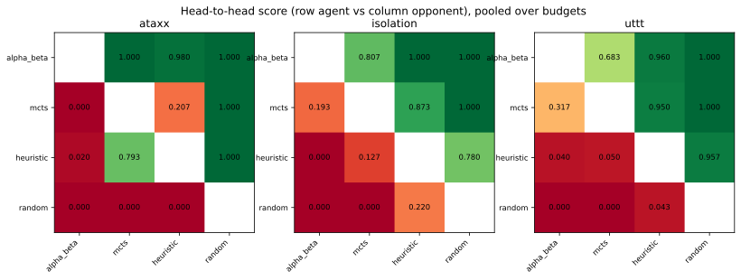
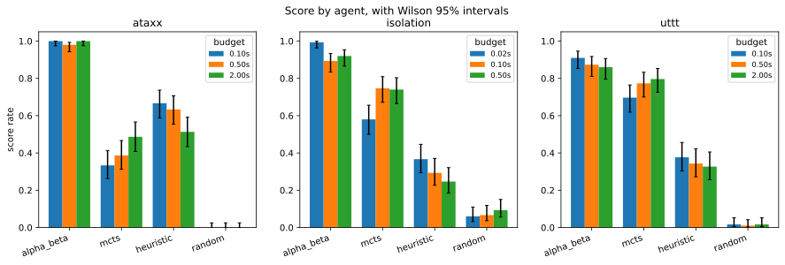
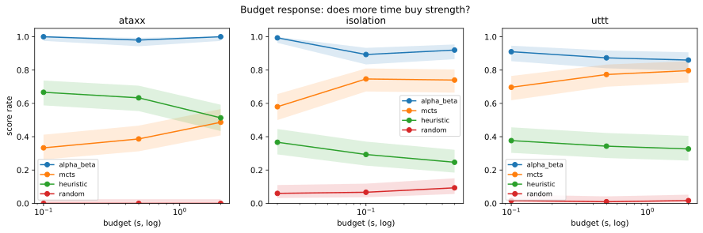

# Tournament report: v2-tournament

## 1. Overview

| property | value |
|---|---|
| games played | 2700 |
| games | ataxx, isolation, uttt |
| configs | easy, hard, main |
| agents | alpha_beta, mcts, heuristic, random |
| error moves | 0 |

**Run time: 9.81 h of search** (summed from every move's `elapsed_s`, so it is derived from the data, not from an external clock), against **9.81 h wall clock**


This is the **V2 run**: the same grid as V1 at 25 trials instead of 20, played
with the **v2 agents** (`agents/v2/`, `evaluation/v2/`), 2700 games in 9 h 49 m.

**V2 exists to do two things, and neither is "find new results".**

1. **Replicate.** V1 was a single sample under a wall-clock budget, which the
   project's own methodology says is not a replayable artifact. V2 is an
   independent sample, on a different day, with different seeds beyond trial 19
   and 25% more games per cell. Whether the headline survives that is worth more
   than any individual number in it.
2. **Instrument.** V1 could not say from its own data which rollout parameters
   produced it. V2 records the agent version and every agent's hyperparameters
   **per game**, plus a full `run_meta.json` written at startup. This run is
   self-describing; V1's method section had to be reconstructed.

**Zero error moves and zero excluded games**, again, over 2700 games. And the
run time derived from the data (9.81 h of summed per-move `elapsed_s`) matches
the wall clock (9.81 h) exactly, which means the machine was never doing
anything else - no stall, no contention, no restart.

## 2. Method for this run

| game | config | budget (s) |
|---|---|---|
| ataxx | hard | 0.1 |
| ataxx | main | 0.5 |
| ataxx | easy | 2.0 |
| isolation | hard | 0.02 |
| isolation | main | 0.1 |
| isolation | easy | 0.5 |
| uttt | hard | 0.1 |
| uttt | main | 0.5 |
| uttt | easy | 2.0 |
| property | value |
|---|---|
| agent_version | v2 |
| budgets | ataxx={'easy': 2.0, 'hard': 0.1, 'main': 0.5}, isolation={'easy': 0.5, 'hard': 0.02, 'main': 0.1}, uttt={'easy': 2.0, 'hard': 0.1, 'main': 0.5} |
| commit | 04d29c63aac254addf918ff5518592f31da6398e |
| configs | easy, main, hard |
| games | isolation, uttt, ataxx |
| platform | Linux-5.15.0-186-generic-x86_64-with-glibc2.35 |
| python | 3.10.12 |
| schedule_size | 2700 |
| trials | 25 |
| wall_clock_source | measured after completion from systemd ExecMainStartTimestamp to the final games.csv write; this run predates record_run_finished() |

**Host** - the budget is wall clock, so results are only comparable against the same machine

| property | value |
|---|---|
| CPU | 13th Gen Intel(R) Core(TM) i7-1365U |
| vCPU | 4 |
| RAM (GB) | 3.82 |
| Disk (GB) | 19.2 |
| OS | Ubuntu 22.04.5 LTS |
| Kernel | Linux-5.15.0-186-generic-x86_64-with-glibc2.35 |
| Architecture | x86_64 |
| Virtualisation | microsoft |

**Agent roster and hyperparameters**, read from `games.csv` rather than from metadata, so it describes what actually ran

| agent | version | hyperparameters |
|---|---|---|
| alpha_beta | v2 | max_entries=200000 |
| heuristic | v2 | - |
| mcts | v2 | epsilon=1.0, max_nodes=50000, rollout_depth=10, sample_k=1 |
| random | v2 | - |

The roster above is **read from `games.csv`, not from a configuration file**.
That is the substantive change from V1, whose equivalent section was
reconstructed from memory and said so.

The distinction matters more than it sounds. Defect D4 was the tournament
silently running MCTS rollout defaults that calibration had ranked *worst*, and
nothing in the resulting data could have revealed it. The parameters now travel
with every game row, so a future reader can verify from the evidence which
configuration produced which result rather than trusting a tag.

Two design choices carried over from V1 and still load-bearing: every pairing is
played in **both seat orders**, and trials are **interleaved across matchups**
rather than run in blocks, so drift or background load reaches all agents
equally instead of accumulating against whichever ran last.

**`easy` still means *more* time and `hard` less.** The names describe difficulty
for the agent, not the size of the budget.

**The host table is part of the result, not bookkeeping.** The budget is wall
clock, so every simulations-per-root and depth figure in this report is a
statement about *this machine*: 4 vCPU of a 13th-gen Intel i7-1365U, 3.82 GB RAM,
Ubuntu 22.04.5, inside a Multipass guest. `systemd-detect-virt` reports
`microsoft` because Multipass uses Hyper-V on Windows - that is the hypervisor,
not a different operating system. A faster host would buy more search per budget
for all four agents equally, so the *comparison* would survive; the absolute
figures would not.

## 3. Results


**ataxx** - head-to-head, pooled over budgets (row agent vs column opponent)

|  | alpha_beta | mcts | heuristic | random |
|---|---|---|---|---|
| alpha_beta | - | 1.000 | 0.980 | 1.000 |
| mcts | 0.000 | - | 0.207 | 1.000 |
| heuristic | 0.020 | 0.793 | - | 1.000 |
| random | 0.000 | 0.000 | 0.000 | - |

**isolation** - head-to-head, pooled over budgets (row agent vs column opponent)

|  | alpha_beta | mcts | heuristic | random |
|---|---|---|---|---|
| alpha_beta | - | 0.807 | 1.000 | 1.000 |
| mcts | 0.193 | - | 0.873 | 1.000 |
| heuristic | 0.000 | 0.127 | - | 0.780 |
| random | 0.000 | 0.000 | 0.220 | - |

**uttt** - head-to-head, pooled over budgets (row agent vs column opponent)

|  | alpha_beta | mcts | heuristic | random |
|---|---|---|---|---|
| alpha_beta | - | 0.683 | 0.960 | 1.000 |
| mcts | 0.317 | - | 0.950 | 1.000 |
| heuristic | 0.040 | 0.050 | - | 0.957 |
| random | 0.000 | 0.000 | 0.043 | - |







**Non-transitivity check** - each pairing once, pooled over budgets. The reverse direction is the complement: score `1 - s`, record reversed.

| game | agent | opponent | score | W-D-L |
|---|---|---|---|---|
| ataxx | alpha_beta | heuristic | 0.980 | 147-0-3 |
| ataxx | alpha_beta | mcts | 1.000 | 150-0-0 |
| ataxx | alpha_beta | random | 1.000 | 150-0-0 |
| ataxx | heuristic | random | 1.000 | 150-0-0 |
| ataxx | mcts | heuristic | 0.207 | 31-0-119 |
| ataxx | mcts | random | 1.000 | 150-0-0 |
| isolation | alpha_beta | heuristic | 1.000 | 150-0-0 |
| isolation | alpha_beta | mcts | 0.807 | 121-0-29 |
| isolation | alpha_beta | random | 1.000 | 150-0-0 |
| isolation | heuristic | random | 0.780 | 117-0-33 |
| isolation | mcts | heuristic | 0.873 | 131-0-19 |
| isolation | mcts | random | 1.000 | 150-0-0 |
| uttt | alpha_beta | heuristic | 0.960 | 141-6-3 |
| uttt | alpha_beta | mcts | 0.683 | 88-29-33 |
| uttt | alpha_beta | random | 1.000 | 150-0-0 |
| uttt | heuristic | random | 0.957 | 142-3-5 |
| uttt | mcts | heuristic | 0.950 | 140-5-5 |
| uttt | mcts | random | 1.000 | 150-0-0 |

-> Full per-config breakdown: [E1](#e1-full-head-to-head). Full score table: [E2](#e2-full-score-table).


**The V1 result replicates.** Every pooled head-to-head moved by at most **0.030**
between runs, against a cell resolution of roughly 0.11. That is the single most
important line in this report: a wall-clock-budgeted tournament is one sample,
and this is the second one agreeing with the first.

**Alpha-Beta wins every cell**, 0.860 to 1.000. As in V1, the interesting
structure is in second place, and it still inverts by game:

| MCTS vs the one-ply heuristic | V1 | V2 |
|---|---|---|
| Isolation (branching ~6) | 0.892 | **0.873** |
| UTTT (branching ~9) | 0.971 | **0.950** |
| Ataxx (branching ~25-31) | 0.225 | **0.207** |

MCTS beats a one-ply evaluator comfortably on the two narrow games and loses to
it badly on the wide one. The ordering flips where **branching factor** jumps,
not where state-space size does - Ataxx is the *middle* game by state space and
the worst for MCTS. **Width, not state-space size, is what defeats sampling-based
search**, and it is now a twice-measured result rather than a single observation.

The non-transitivity table carries the cleanest single piece of evidence in the
study: on Ataxx, MCTS scores **1.000 against the random agent and 0.207 against
the heuristic**. An implementation defect does not produce a perfect record
against one opponent and a poor one against another in the same cell. MCTS is
**beaten, not broken**.

## 4. Budget response


**ataxx / alpha_beta**

| budget (s) | config | score | games |
|---|---|---|---|
| 0.1 | hard | 1.000 [0.975-1.000] | 150 |
| 0.5 | main | 0.980 [0.943-0.993] | 150 |
| 2.0 | easy | 1.000 [0.975-1.000] | 150 |

**ataxx / heuristic**

| budget (s) | config | score | games |
|---|---|---|---|
| 0.1 | hard | 0.667 [0.588-0.737] | 150 |
| 0.5 | main | 0.633 [0.554-0.706] | 150 |
| 2.0 | easy | 0.513 [0.434-0.592] | 150 |

**ataxx / mcts**

| budget (s) | config | score | games |
|---|---|---|---|
| 0.1 | hard | 0.333 [0.263-0.412] | 150 |
| 0.5 | main | 0.387 [0.312-0.467] | 150 |
| 2.0 | easy | 0.487 [0.408-0.566] | 150 |

**ataxx / random**

| budget (s) | config | score | games |
|---|---|---|---|
| 0.1 | hard | 0.000 [0.000-0.025] | 150 |
| 0.5 | main | 0.000 [0.000-0.025] | 150 |
| 2.0 | easy | 0.000 [0.000-0.025] | 150 |

**isolation / alpha_beta**

| budget (s) | config | score | games |
|---|---|---|---|
| 0.02 | hard | 0.993 [0.963-0.999] | 150 |
| 0.1 | main | 0.893 [0.834-0.933] | 150 |
| 0.5 | easy | 0.920 [0.865-0.954] | 150 |

**isolation / heuristic**

| budget (s) | config | score | games |
|---|---|---|---|
| 0.02 | hard | 0.367 [0.294-0.446] | 150 |
| 0.1 | main | 0.293 [0.226-0.371] | 150 |
| 0.5 | easy | 0.247 [0.185-0.321] | 150 |

**isolation / mcts**

| budget (s) | config | score | games |
|---|---|---|---|
| 0.02 | hard | 0.580 [0.500-0.656] | 150 |
| 0.1 | main | 0.747 [0.672-0.810] | 150 |
| 0.5 | easy | 0.740 [0.664-0.804] | 150 |

**isolation / random**

| budget (s) | config | score | games |
|---|---|---|---|
| 0.02 | hard | 0.060 [0.032-0.110] | 150 |
| 0.1 | main | 0.067 [0.037-0.118] | 150 |
| 0.5 | easy | 0.093 [0.056-0.151] | 150 |

**uttt / alpha_beta**

| budget (s) | config | score | games |
|---|---|---|---|
| 0.1 | hard | 0.910 [0.853-0.946] | 150 |
| 0.5 | main | 0.873 [0.811-0.917] | 150 |
| 2.0 | easy | 0.860 [0.795-0.907] | 150 |

**uttt / heuristic**

| budget (s) | config | score | games |
|---|---|---|---|
| 0.1 | hard | 0.377 [0.303-0.456] | 150 |
| 0.5 | main | 0.343 [0.272-0.422] | 150 |
| 2.0 | easy | 0.327 [0.257-0.405] | 150 |

**uttt / mcts**

| budget (s) | config | score | games |
|---|---|---|---|
| 0.1 | hard | 0.697 [0.619-0.765] | 150 |
| 0.5 | main | 0.773 [0.700-0.833] | 150 |
| 2.0 | easy | 0.797 [0.725-0.853] | 150 |

**uttt / random**

| budget (s) | config | score | games |
|---|---|---|---|
| 0.1 | hard | 0.017 [0.005-0.052] | 150 |
| 0.5 | main | 0.010 [0.002-0.042] | 150 |
| 2.0 | easy | 0.017 [0.005-0.052] | 150 |




Read this section carefully, because the most eye-catching pattern in it is an
artifact and mistaking it for a finding would be easy.

**Alpha-Beta appears to get *worse* with more time.** On UTTT it goes 0.910 →
0.873 → 0.860 across a 20x budget increase; on Isolation, 0.993 at the *tightest*
0.02 s budget down to 0.920 at 0.5 s. Taken at face value that would say extra
search hurts an exact searcher, which is absurd.

**It is a property of the field score, not of Alpha-Beta.** Every agent is scored
against the same four-agent pool, and MCTS *does* improve with budget - 0.697 →
0.773 → 0.797 on UTTT, 0.580 → 0.747 → 0.740 on Isolation. When one member of the
pool gets stronger, everyone else's field score falls, whether or not they
changed. The heuristic shows the same thing even more starkly: it consumes
essentially none of the budget (see instrument validation) and yet declines on
every game as the budget rises.

The honest reading is the one V1 reached: **Alpha-Beta has saturated.** It has
solved or near-solved these positions at the smallest budget, so extra time buys
it nothing, and its *relative* score drifts down as its opponents improve. This
is exactly why Isolation is a **control** rather than a degradation datapoint.

**MCTS is the only agent that converts time into strength**, and the effect is
largest where it is weakest: on Ataxx, 0.333 → 0.387 → **0.487** across a 20x
budget increase, still climbing at the largest budget. Head-to-head against the
heuristic the same trend is sharper. MCTS is not stuck on Ataxx; it is
**under-resourced for the width**, and the budget it would need is well beyond
anything this grid can afford.

## 5. Search volume and viability

| game | config | agent | mean sims | median /root | p5 /root | % below floor | verdict |
|---|---|---|---|---|---|---|---|
| ataxx | easy | mcts | 15177.7 | 320.8 | 123.9 | 0.0% | ample |
| ataxx | hard | mcts | 388.4 | 18.2 | 3.6 | 32.4% | viable |
| ataxx | main | mcts | 2703.7 | 91.7 | 36.2 | 0.0% | ample |
| isolation | easy | mcts | 84803.4 | 10076.9 | 1114.2 | 0.0% | ample |
| isolation | hard | mcts | 2869.1 | 274.0 | 47.1 | 0.0% | ample |
| isolation | main | mcts | 15784.4 | 1457.0 | 230.6 | 0.0% | ample |
| uttt | easy | mcts | 53169.8 | 1891.2 | 484.9 | 0.0% | ample |
| uttt | hard | mcts | 1481.9 | 94.3 | 19.8 | 2.5% | ample |
| uttt | main | mcts | 10287.1 | 469.9 | 93.9 | 0.0% | ample |

**Alpha-Beta depth reached**

| game | config | agent | median depth | max depth |
|---|---|---|---|---|
| ataxx | easy | alpha_beta | 4.0 | 9 |
| ataxx | hard | alpha_beta | 3.0 | 6 |
| ataxx | main | alpha_beta | 4.0 | 7 |
| isolation | easy | alpha_beta | 6.0 | 18 |
| isolation | hard | alpha_beta | 5.0 | 13 |
| isolation | main | alpha_beta | 6.0 | 16 |
| uttt | easy | alpha_beta | 7.0 | 64 |
| uttt | hard | alpha_beta | 5.0 | 64 |
| uttt | main | alpha_beta | 6.0 | 64 |


No decision anywhere in this run fell below one simulation per root move, so
"MCTS never got to search" is false everywhere. But **clearing the viability
floor is not sufficiency**: Ataxx-main sits at 91.7 simulations per root move,
comfortably "ample" by the `>= 30` threshold, and still scores 0.207 against a
one-ply evaluator. The floor buys the ability to try each candidate once. It does
not buy competitive play at width 25-31.

**Ataxx-hard got thinner than in V1** - 32.4% of decisions below the floor
against 20.1%, with the median falling 23.5 → 18.2. This is worth stating
precisely, because the obvious explanation is wrong:

- **The machine did not slow down.** Budget compliance is identical at 100.1%
  mean, and V2's tail is actually *better* (106.9% max against V1's 114.2%).
- **Simulations barely moved** - median 360 → 346 per decision.
- **The denominator grew.** MCTS faced a mean of **30.72 legal moves against
  25.34** in V1. More games ended by elimination (220 of 300 against 171 of 240)
  and games ran slightly longer, leaving MCTS deciding in more mid-game Ataxx
  positions - which is exactly where branching peaks.

So the ratio fell because the positions were wider, not because the search was
slower. That is a small illustration of a general hazard with ratios, and the
reason `p5` and `% below floor` are reported beside the median rather than a
single number.

Alpha-Beta tells the same story from the other side: median depth **3-4 on
Ataxx** against 5-7 on Isolation and UTTT. Both paradigms are squeezed by width;
they fail differently.

## 6. Instrument validation


**Budget compliance** (elapsed / budget)

| game | config | agent | mean | p99 | max | moves |
|---|---|---|---|---|---|---|
| ataxx | easy | alpha_beta | 91.5% | 100.0% | 100.6% | 3991 |
| ataxx | easy | heuristic | 0.0% | 0.1% | 1.3% | 3778 |
| ataxx | easy | mcts | 100.0% | 100.4% | 103.1% | 3895 |
| ataxx | easy | random | 0.0% | 0.0% | 0.0% | 793 |
| ataxx | hard | alpha_beta | 92.3% | 100.5% | 115.0% | 2755 |
| ataxx | hard | heuristic | 0.7% | 1.9% | 3.9% | 3043 |
| ataxx | hard | mcts | 100.1% | 101.2% | 106.9% | 2965 |
| ataxx | hard | random | 0.0% | 0.0% | 0.0% | 1665 |
| ataxx | main | alpha_beta | 91.9% | 100.1% | 106.8% | 3626 |
| ataxx | main | heuristic | 0.2% | 0.4% | 0.8% | 4004 |
| ataxx | main | mcts | 100.0% | 100.2% | 104.3% | 3843 |
| ataxx | main | random | 0.0% | 0.0% | 0.0% | 808 |
| isolation | easy | alpha_beta | 34.7% | 100.0% | 101.8% | 956 |
| isolation | easy | heuristic | 0.0% | 0.0% | 0.0% | 1057 |
| isolation | easy | mcts | 100.0% | 100.2% | 103.3% | 1081 |
| isolation | easy | random | 0.0% | 0.0% | 0.0% | 905 |
| isolation | hard | alpha_beta | 53.1% | 101.1% | 147.3% | 974 |
| isolation | hard | heuristic | 0.2% | 0.4% | 5.1% | 1092 |
| isolation | hard | mcts | 100.2% | 101.9% | 142.1% | 1111 |
| isolation | hard | random | 0.0% | 0.1% | 0.1% | 927 |
| isolation | main | alpha_beta | 46.0% | 100.3% | 124.2% | 984 |
| isolation | main | heuristic | 0.0% | 0.1% | 0.4% | 1028 |
| isolation | main | mcts | 100.1% | 103.4% | 109.7% | 1113 |
| isolation | main | random | 0.0% | 0.0% | 0.1% | 893 |
| uttt | easy | alpha_beta | 89.9% | 100.1% | 102.6% | 3092 |
| uttt | easy | heuristic | 0.0% | 0.3% | 0.7% | 2652 |
| uttt | easy | mcts | 100.0% | 100.1% | 101.7% | 3038 |
| uttt | easy | random | 0.0% | 0.0% | 0.0% | 2725 |
| uttt | hard | alpha_beta | 93.4% | 101.3% | 113.2% | 3152 |
| uttt | hard | heuristic | 0.9% | 6.5% | 12.7% | 2821 |
| uttt | hard | mcts | 100.1% | 100.3% | 115.8% | 3032 |
| uttt | hard | random | 0.0% | 0.0% | 0.1% | 2878 |
| uttt | main | alpha_beta | 91.4% | 100.2% | 101.1% | 3109 |
| uttt | main | heuristic | 0.2% | 1.3% | 3.1% | 2706 |
| uttt | main | mcts | 100.0% | 100.1% | 103.8% | 3040 |
| uttt | main | random | 0.0% | 0.0% | 0.0% | 2808 |

**Every agent against the random agent** - a one-ply evaluator should dominate here; a weak control game shows up as a low score

| game | agent | score | W-D-L |
|---|---|---|---|
| ataxx | alpha_beta | 1.000 | 150-0-0 |
| ataxx | heuristic | 1.000 | 150-0-0 |
| ataxx | mcts | 1.000 | 150-0-0 |
| isolation | alpha_beta | 1.000 | 150-0-0 |
| isolation | heuristic | 0.780 | 117-0-33 |
| isolation | mcts | 1.000 | 150-0-0 |
| uttt | alpha_beta | 1.000 | 150-0-0 |
| uttt | heuristic | 0.957 | 142-3-5 |
| uttt | mcts | 1.000 | 150-0-0 |

**First-move advantage** (decisive games only): first 1373, second 1284, decisive 2657, draws excluded 43, p = 0.0878


-> Move-tag distribution: [E3](#e3-move-tag-distribution).


**MCTS uses its full budget everywhere** - mean 100.0-100.2% of budget in all
nine cells. It is anytime by construction and stops only when the clock says so,
which is what a wall-clock comparison requires.

**Alpha-Beta's means are the diagnostic ones.** 92-93% on Ataxx and UTTT, but
**34.7-53.1% on Isolation**. It is not being cut off there; it is *finishing* -
completing iterative deepening and returning on a proven result. An agent that
cannot spend its budget has solved the position, which independently confirms
Isolation as the control game.

**The worst overshoot in the run is again Isolation-hard**: Alpha-Beta at 147.3%
and MCTS at 142.1% of a 0.02 s budget - roughly 8-9 ms over. Both are rare tail
events against means of 53.1% and 100.2%, and the cell was predicted to be the
most exposed: at 0.02 s a single hypervisor scheduling quantum is a large
fraction of the budget before the algorithm does anything. **Isolation-hard
results carry more timing uncertainty than any other cell** and should be quoted
with that caveat.

**The weak control persists, and the obvious explanation has been ruled out.**
The heuristic scores **0.780 against the random agent on Isolation**, against
0.957 on UTTT and 1.000 on Ataxx. V2 fixed a real defect here - v1's one-ply
agent declined an available immediate win in 28.0% of such positions on Isolation
- and the score moved only from 0.750 to 0.780, well inside the interval.
Declining a win usually still wins from a mobility advantage, so the rate of
declined wins was never the rate of lost games. **Why a one-ply mobility
evaluator loses a fifth of its games to random play on a 5x5 board is still
unexplained**, and it is the first open lead for v3.

**First-move advantage is not significant** (first 1373, second 1284, p = 0.0878
over 2657 decisive games). Closer to the line than V1's 0.1229 and worth watching
across runs, but playing every pairing in both seat orders means any residual
advantage is shared equally and cannot favour one agent.

**The memory cap binds only at the largest budgets** - 1637 memory-limited moves,
all Alpha-Beta, concentrated where a long search fills the transposition table.
It never binds on Isolation at any budget.

## 7. Game characteristics

| game | config | mean plies | median plies | games |
|---|---|---|---|---|
| ataxx | easy | 41.5 | 20.5 | 300 |
| ataxx | hard | 34.8 | 16.0 | 300 |
| ataxx | main | 40.9 | 18.0 | 300 |
| isolation | easy | 13.3 | 13.0 | 300 |
| isolation | hard | 13.7 | 13.5 | 300 |
| isolation | main | 13.4 | 13.0 | 300 |
| uttt | easy | 38.4 | 37.0 | 300 |
| uttt | hard | 39.6 | 39.0 | 300 |
| uttt | main | 38.9 | 38.0 | 300 |

**Where the search time went**

| game | config | hours | % of run |
|---|---|---|---|
| ataxx | easy | 4.19 | 42.7% |
| uttt | easy | 3.23 | 33.0% |
| ataxx | main | 1.00 | 10.2% |
| uttt | main | 0.82 | 8.3% |
| isolation | easy | 0.20 | 2.0% |
| uttt | hard | 0.17 | 1.7% |
| ataxx | hard | 0.15 | 1.6% |
| isolation | main | 0.04 | 0.4% |
| isolation | hard | 0.01 | 0.1% |

-> End-reason breakdown: [E4](#e4-end-reasons).


**Ataxx game length is bimodal and its mean should not be quoted alone.** At the
easy budget the mean is 41.5 plies against a median of 20.5; at hard, 34.8 against
16.0. Games involving the random agent end in roughly ten plies because random
play is eliminated almost immediately, while agent-versus-agent games run three
to four times longer. A single mean describes no actual game.

That gap is also what broke the original runtime estimate. The V1 projection used
**random self-play** lengths - 182.6 plies on Ataxx - while real agent play is
under 42. The run was projected at 21 h and took under 8. Branching-factor
measurements from random play remain valid, because those are move *counts*; game
*lengths* from random play must not be used to size an agent tournament.

The end-reason split confirms the mechanism and shows a budget effect: Ataxx ends
by **elimination** far more often at the tight budget (220 of 300) than at the
generous one (166 of 300), because weaker play gets wiped out rather than filling
the board. Isolation always ends with a player having no legal move; UTTT ends on
a line in about 95% of games with a handful of early draws.

Isolation and UTTT are by contrast very stable - 13.3-13.7 and 38.4-39.6 plies
regardless of budget - so budget affects **how well** those games are played, not
how long they last.

**Where the time went** is worth noting for anyone planning a future run: two
cells, Ataxx-easy and UTTT-easy, account for **75.7%** of the entire 9.81 hours.
All of Isolation is 2.5%. Any attempt to shorten a run, or to buy more trials,
has to start there.

## 8. Limitations


Scores are Wilson 95% intervals. With 150 games in the smallest head-to-head cell, differences below roughly 0.15 are not resolvable. A wall-clock budget makes the run one sample rather than a replayable artifact.


**This run is one sample, and so was V1.** The budget is wall clock - the only
unit that is fair across two search paradigms - which means the number of nodes
Alpha-Beta expands depends on how fast the machine happened to be for those
milliseconds. Re-running identical seeds does not reproduce identical games. What
V2 adds is not certainty but **agreement**: two independent samples reaching the
same conclusions is materially stronger than one, and every claim in this report
should still be read with its interval rather than as a bare percentage.

**Resolution.** 150 games per field-score cell and 50 per head-to-head cell give
95% intervals roughly ±0.08 and ±0.13 wide. Differences smaller than that are not
resolvable, and the largest V1-to-V2 movement was 0.030 - comfortably inside the
noise, which is the correct way to read "it replicated". It also sets the bar for
v3: **a change that moves a head-to-head score by less than about 0.13 will not
be visible in a grid run** and needs a targeted head-to-head at far higher
repetition instead.

**Field scores are not absolute strength.** As section 4 shows, an agent's field
score falls when *other* agents in the pool improve, even if it has not changed.
Head-to-head numbers are the ones that support claims about a specific matchup.

**Single host, single interpreter.** One Multipass guest - 4 vCPU of an Intel
i7-1365U, 3.82 GB RAM, Ubuntu 22.04.5, Python 3.10.12 - all now recorded in the
method section rather than remembered. A faster host or interpreter buys more
search per budget for all four agents equally, so the comparison stays fair, but
**the absolute simulations-per-root and depth figures are not portable** and
should always be quoted with the machine.

Note also that 4 vCPU does not mean the run used four cores: the harness is
strictly single-threaded and sequential. The spare cores exist to keep anything
else on the guest from stealing time mid-decision, which is isolation rather than
speed.

**Two known weaknesses in the instrument.** Isolation-hard carries the largest
timing tail in the run (147.3% of a 0.02 s budget). And the Isolation heuristic
scores only 0.780 against random, which is weak for a designated control and now
demonstrably *not* explained by the defect V2 fixed.

**What this run does not answer.** It does not establish where MCTS would overtake
the heuristic on Ataxx - only that it had not by 2.0 s while still improving. It
does not test enhancements to either paradigm. And it does not vary board size
independently of game, so "width" remains confounded with everything else that
differs between the three games.


---

## Extras


### E1. Full head-to-head


One row per pairing per config. The reverse direction is the complement and is not listed.

| game | config | agent | opponent | score | W-D-L | games |
|---|---|---|---|---|---|---|
| ataxx | easy | alpha_beta | heuristic | 1.000 [0.929-1.000] | 50-0-0 | 50 |
| ataxx | easy | alpha_beta | mcts | 1.000 [0.929-1.000] | 50-0-0 | 50 |
| ataxx | easy | alpha_beta | random | 1.000 [0.929-1.000] | 50-0-0 | 50 |
| ataxx | easy | heuristic | random | 1.000 [0.929-1.000] | 50-0-0 | 50 |
| ataxx | easy | mcts | heuristic | 0.460 [0.330-0.596] | 23-0-27 | 50 |
| ataxx | easy | mcts | random | 1.000 [0.929-1.000] | 50-0-0 | 50 |
| ataxx | hard | alpha_beta | heuristic | 1.000 [0.929-1.000] | 50-0-0 | 50 |
| ataxx | hard | alpha_beta | mcts | 1.000 [0.929-1.000] | 50-0-0 | 50 |
| ataxx | hard | alpha_beta | random | 1.000 [0.929-1.000] | 50-0-0 | 50 |
| ataxx | hard | heuristic | random | 1.000 [0.929-1.000] | 50-0-0 | 50 |
| ataxx | hard | mcts | heuristic | 0.000 [0.000-0.071] | 0-0-50 | 50 |
| ataxx | hard | mcts | random | 1.000 [0.929-1.000] | 50-0-0 | 50 |
| ataxx | main | alpha_beta | heuristic | 0.940 [0.838-0.979] | 47-0-3 | 50 |
| ataxx | main | alpha_beta | mcts | 1.000 [0.929-1.000] | 50-0-0 | 50 |
| ataxx | main | alpha_beta | random | 1.000 [0.929-1.000] | 50-0-0 | 50 |
| ataxx | main | heuristic | random | 1.000 [0.929-1.000] | 50-0-0 | 50 |
| ataxx | main | mcts | heuristic | 0.160 [0.083-0.285] | 8-0-42 | 50 |
| ataxx | main | mcts | random | 1.000 [0.929-1.000] | 50-0-0 | 50 |
| isolation | easy | alpha_beta | heuristic | 1.000 [0.929-1.000] | 50-0-0 | 50 |
| isolation | easy | alpha_beta | mcts | 0.760 [0.626-0.857] | 38-0-12 | 50 |
| isolation | easy | alpha_beta | random | 1.000 [0.929-1.000] | 50-0-0 | 50 |
| isolation | easy | heuristic | random | 0.720 [0.583-0.825] | 36-0-14 | 50 |
| isolation | easy | mcts | heuristic | 0.980 [0.895-0.996] | 49-0-1 | 50 |
| isolation | easy | mcts | random | 1.000 [0.929-1.000] | 50-0-0 | 50 |
| isolation | hard | alpha_beta | heuristic | 1.000 [0.929-1.000] | 50-0-0 | 50 |
| isolation | hard | alpha_beta | mcts | 0.980 [0.895-0.996] | 49-0-1 | 50 |
| isolation | hard | alpha_beta | random | 1.000 [0.929-1.000] | 50-0-0 | 50 |
| isolation | hard | heuristic | random | 0.820 [0.692-0.902] | 41-0-9 | 50 |
| isolation | hard | mcts | heuristic | 0.720 [0.583-0.825] | 36-0-14 | 50 |
| isolation | hard | mcts | random | 1.000 [0.929-1.000] | 50-0-0 | 50 |
| isolation | main | alpha_beta | heuristic | 1.000 [0.929-1.000] | 50-0-0 | 50 |
| isolation | main | alpha_beta | mcts | 0.680 [0.542-0.792] | 34-0-16 | 50 |
| isolation | main | alpha_beta | random | 1.000 [0.929-1.000] | 50-0-0 | 50 |
| isolation | main | heuristic | random | 0.800 [0.670-0.888] | 40-0-10 | 50 |
| isolation | main | mcts | heuristic | 0.920 [0.812-0.968] | 46-0-4 | 50 |
| isolation | main | mcts | random | 1.000 [0.929-1.000] | 50-0-0 | 50 |
| uttt | easy | alpha_beta | heuristic | 0.980 [0.895-0.996] | 49-0-1 | 50 |
| uttt | easy | alpha_beta | mcts | 0.600 [0.462-0.724] | 24-12-14 | 50 |
| uttt | easy | alpha_beta | random | 1.000 [0.929-1.000] | 50-0-0 | 50 |
| uttt | easy | heuristic | random | 0.950 [0.851-0.984] | 47-1-2 | 50 |
| uttt | easy | mcts | heuristic | 0.990 [0.911-0.999] | 49-1-0 | 50 |
| uttt | easy | mcts | random | 1.000 [0.929-1.000] | 50-0-0 | 50 |
| uttt | hard | alpha_beta | heuristic | 0.920 [0.812-0.968] | 44-4-2 | 50 |
| uttt | hard | alpha_beta | mcts | 0.810 [0.681-0.895] | 37-7-6 | 50 |
| uttt | hard | alpha_beta | random | 1.000 [0.929-1.000] | 50-0-0 | 50 |
| uttt | hard | heuristic | random | 0.950 [0.851-0.984] | 47-1-2 | 50 |
| uttt | hard | mcts | heuristic | 0.900 [0.786-0.957] | 44-2-4 | 50 |
| uttt | hard | mcts | random | 1.000 [0.929-1.000] | 50-0-0 | 50 |
| uttt | main | alpha_beta | heuristic | 0.980 [0.895-0.996] | 48-2-0 | 50 |
| uttt | main | alpha_beta | mcts | 0.640 [0.501-0.759] | 27-10-13 | 50 |
| uttt | main | alpha_beta | random | 1.000 [0.929-1.000] | 50-0-0 | 50 |
| uttt | main | heuristic | random | 0.970 [0.880-0.993] | 48-1-1 | 50 |
| uttt | main | mcts | heuristic | 0.960 [0.865-0.989] | 47-2-1 | 50 |
| uttt | main | mcts | random | 1.000 [0.929-1.000] | 50-0-0 | 50 |

### E2. Full score table

| game | config | agent | W | D | L | score |
|---|---|---|---|---|---|---|
| ataxx | easy | alpha_beta | 150 | 0 | 0 | 1.000 [0.975-1.000] |
| ataxx | easy | heuristic | 77 | 0 | 73 | 0.513 [0.434-0.592] |
| ataxx | easy | mcts | 73 | 0 | 77 | 0.487 [0.408-0.566] |
| ataxx | easy | random | 0 | 0 | 150 | 0.000 [0.000-0.025] |
| ataxx | hard | alpha_beta | 150 | 0 | 0 | 1.000 [0.975-1.000] |
| ataxx | hard | heuristic | 100 | 0 | 50 | 0.667 [0.588-0.737] |
| ataxx | hard | mcts | 50 | 0 | 100 | 0.333 [0.263-0.412] |
| ataxx | hard | random | 0 | 0 | 150 | 0.000 [0.000-0.025] |
| ataxx | main | alpha_beta | 147 | 0 | 3 | 0.980 [0.943-0.993] |
| ataxx | main | heuristic | 95 | 0 | 55 | 0.633 [0.554-0.706] |
| ataxx | main | mcts | 58 | 0 | 92 | 0.387 [0.312-0.467] |
| ataxx | main | random | 0 | 0 | 150 | 0.000 [0.000-0.025] |
| isolation | easy | alpha_beta | 138 | 0 | 12 | 0.920 [0.865-0.954] |
| isolation | easy | heuristic | 37 | 0 | 113 | 0.247 [0.185-0.321] |
| isolation | easy | mcts | 111 | 0 | 39 | 0.740 [0.664-0.804] |
| isolation | easy | random | 14 | 0 | 136 | 0.093 [0.056-0.151] |
| isolation | hard | alpha_beta | 149 | 0 | 1 | 0.993 [0.963-0.999] |
| isolation | hard | heuristic | 55 | 0 | 95 | 0.367 [0.294-0.446] |
| isolation | hard | mcts | 87 | 0 | 63 | 0.580 [0.500-0.656] |
| isolation | hard | random | 9 | 0 | 141 | 0.060 [0.032-0.110] |
| isolation | main | alpha_beta | 134 | 0 | 16 | 0.893 [0.834-0.933] |
| isolation | main | heuristic | 44 | 0 | 106 | 0.293 [0.226-0.371] |
| isolation | main | mcts | 112 | 0 | 38 | 0.747 [0.672-0.810] |
| isolation | main | random | 10 | 0 | 140 | 0.067 [0.037-0.118] |
| uttt | easy | alpha_beta | 123 | 12 | 15 | 0.860 [0.795-0.907] |
| uttt | easy | heuristic | 48 | 2 | 100 | 0.327 [0.257-0.405] |
| uttt | easy | mcts | 113 | 13 | 24 | 0.797 [0.725-0.853] |
| uttt | easy | random | 2 | 1 | 147 | 0.017 [0.005-0.052] |
| uttt | hard | alpha_beta | 131 | 11 | 8 | 0.910 [0.853-0.946] |
| uttt | hard | heuristic | 53 | 7 | 90 | 0.377 [0.303-0.456] |
| uttt | hard | mcts | 100 | 9 | 41 | 0.697 [0.619-0.765] |
| uttt | hard | random | 2 | 1 | 147 | 0.017 [0.005-0.052] |
| uttt | main | alpha_beta | 125 | 12 | 13 | 0.873 [0.811-0.917] |
| uttt | main | heuristic | 49 | 5 | 96 | 0.343 [0.272-0.422] |
| uttt | main | mcts | 110 | 12 | 28 | 0.773 [0.700-0.833] |
| uttt | main | random | 1 | 1 | 148 | 0.010 [0.002-0.042] |

### E3. Move-tag distribution

| agent | tag | count |
|---|---|---|
| alpha_beta | memory-limited | 1637 |
| alpha_beta | normal | 3552 |
| alpha_beta | time-limited | 17450 |
| heuristic | normal | 22181 |
| mcts | time-limited | 23118 |
| random | normal | 14402 |

### E4. End reasons

| game | config | reason | count |
|---|---|---|---|
| ataxx | easy | board_full | 134 |
| ataxx | easy | eliminated | 166 |
| ataxx | hard | board_full | 80 |
| ataxx | hard | eliminated | 220 |
| ataxx | main | board_full | 128 |
| ataxx | main | eliminated | 172 |
| isolation | easy | no_moves | 300 |
| isolation | hard | no_moves | 300 |
| isolation | main | no_moves | 300 |
| uttt | easy | early_draw | 14 |
| uttt | easy | line | 286 |
| uttt | hard | early_draw | 14 |
| uttt | hard | line | 286 |
| uttt | main | early_draw | 15 |
| uttt | main | line | 285 |

### E5. Provenance


Regenerate this report with:

```bash
python3 -m experiments.analyse --raw results/raw \
        --json results/analysis.json --label v2-tournament
python3 -m experiments.report --analysis results/analysis.json
```

