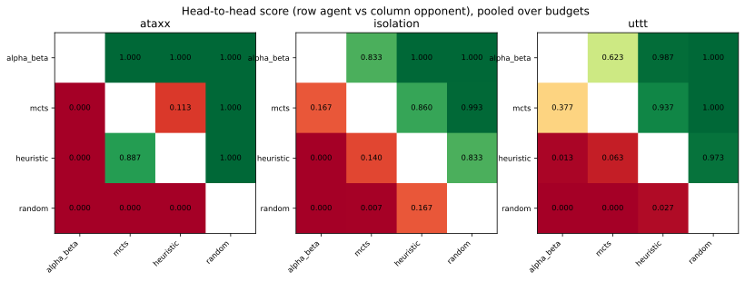
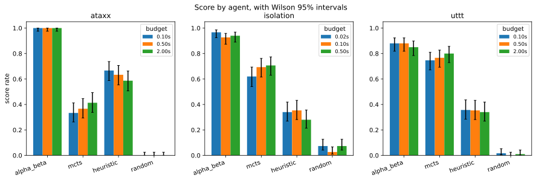
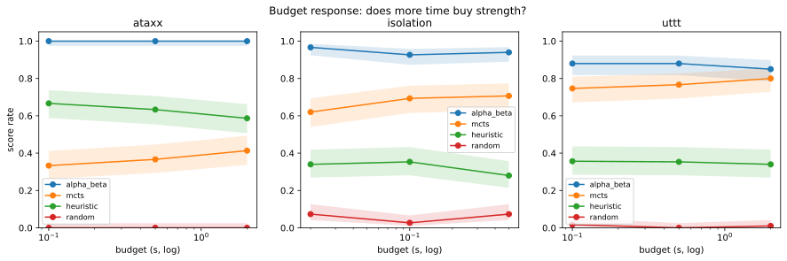

# Tournament report: v3-tournament

## 1. Overview

| property | value |
|---|---|
| games played | 2700 |
| games | ataxx, isolation, uttt |
| configs | easy, hard, main |
| agents | alpha_beta, mcts, heuristic, random |
| error moves | 0 |

**Run time: 9.94 h of search** (summed from every move's `elapsed_s`, so it is derived from the data, not from an external clock), against **10.03 h wall clock**


This is the **V3 run**: the same grid as V2 - 3 games x 12 directed matchups x
3 budgets x 25 trials - played with the **v3 agents**, 2700 games in 10.03 h.

V3 is the first run that changes how the agents *search* rather than how the
run is *recorded*. Five changes went in together: an Ataxx evaluator
reweighted from 70/30 to 47/53, MCTS subtree reuse between consecutive turns,
independent per-seat RNG streams, bounded-memory instrumentation, and the
removal of duplicated legal-move generation in the hot search paths.

**The result is easy to state and worth stating first: the search changes
worked, and they changed nothing measurable about who wins.** Both halves of
that sentence are supported below, and the combination is more interesting
than either half alone.

**Zero error moves and zero excluded games** over 2700 games, for the third run
running. Run time derived from the data (9.94 h of summed per-move `elapsed_s`)
sits just under the 10.03 h wall clock, so the machine was doing essentially
nothing else.

## 2. Method for this run

| game | config | budget (s) |
|---|---|---|
| ataxx | hard | 0.1 |
| ataxx | main | 0.5 |
| ataxx | easy | 2.0 |
| isolation | hard | 0.02 |
| isolation | main | 0.1 |
| isolation | easy | 0.5 |
| uttt | hard | 0.1 |
| uttt | main | 0.5 |
| uttt | easy | 2.0 |
| property | value |
|---|---|
| agent_version | v3 |
| budgets | ataxx={'easy': 2.0, 'hard': 0.1, 'main': 0.5}, isolation={'easy': 0.5, 'hard': 0.02, 'main': 0.1}, uttt={'easy': 2.0, 'hard': 0.1, 'main': 0.5} |
| commit | 195b1d51b2534f9ab884ae7cfc5e82e1f0f9fd21 |
| configs | easy, main, hard |
| experiment | main_tournament |
| games | isolation, uttt, ataxx |
| platform | Linux-5.15.0-186-generic-x86_64-with-glibc2.35 |
| python | 3.10.12 |
| rng_streams | per_side |
| schedule_size | 2700 |
| trials | 25 |

**Host** - the budget is wall clock, so results are only comparable against the same machine

| property | value |
|---|---|
| CPU | 13th Gen Intel(R) Core(TM) i7-1365U |
| vCPU | 4 |
| RAM (GB) | 3.82 |
| Disk (GB) | 19.2 |
| OS | Ubuntu 22.04.5 LTS |
| Kernel | Linux-5.15.0-186-generic-x86_64-with-glibc2.35 |
| Architecture | x86_64 |
| Virtualisation | microsoft |

**Agent roster and hyperparameters**, read from `games.csv` rather than from metadata, so it describes what actually ran

| agent | version | hyperparameters |
|---|---|---|
| alpha_beta | v3 | max_entries=200000 |
| heuristic | v3 | - |
| mcts | v3 | epsilon=1.0, max_nodes=50000, rollout_depth=10, sample_k=1, tree_reuse=True |
| random | v3 | - |

Everything in the roster above is **read from `games.csv`**, so this run can
prove its own configuration rather than asking a reader to trust a tag.

**Five changes landed at once, and that limits what this run can attribute.**
If a number had moved, it would not be possible to say which change moved it.
That was an acceptable trade for a first pass - the changes were expected to be
complementary and each was screened separately beforehand - but it means V3
answers "did this bundle help?" and not "which part helped?".

One change deserves specific mention because it alters the sampling rather than
the agents: **V3 gives each seat its own RNG stream**, derived deterministically
from the game seed. V1 and V2 shared one stream between both seats, which meant
the agent that used more random numbers consumed draws the opponent would
otherwise have seen. That was never wrong, but it coupled the two seats. The
consequence for reading this report is that V3 is a genuinely independent
sample from V2 - not the same games played by slightly better agents.

**The host table is part of the result.** The budget is wall clock, so every
simulations-per-root and depth figure here is a statement about this machine:
4 vCPU of an Intel i7-1365U, 3.82 GB RAM, Ubuntu 22.04.5 inside a Multipass
guest. `systemd-detect-virt` reports `microsoft` because Multipass uses Hyper-V
on Windows; that is the hypervisor, not a different operating system.

## 3. Results


**ataxx** - head-to-head, pooled over budgets (row agent vs column opponent)

|  | alpha_beta | mcts | heuristic | random |
|---|---|---|---|---|
| alpha_beta | - | 1.000 | 1.000 | 1.000 |
| mcts | 0.000 | - | 0.113 | 1.000 |
| heuristic | 0.000 | 0.887 | - | 1.000 |
| random | 0.000 | 0.000 | 0.000 | - |

**isolation** - head-to-head, pooled over budgets (row agent vs column opponent)

|  | alpha_beta | mcts | heuristic | random |
|---|---|---|---|---|
| alpha_beta | - | 0.833 | 1.000 | 1.000 |
| mcts | 0.167 | - | 0.860 | 0.993 |
| heuristic | 0.000 | 0.140 | - | 0.833 |
| random | 0.000 | 0.007 | 0.167 | - |

**uttt** - head-to-head, pooled over budgets (row agent vs column opponent)

|  | alpha_beta | mcts | heuristic | random |
|---|---|---|---|---|
| alpha_beta | - | 0.623 | 0.987 | 1.000 |
| mcts | 0.377 | - | 0.937 | 1.000 |
| heuristic | 0.013 | 0.063 | - | 0.973 |
| random | 0.000 | 0.000 | 0.027 | - |







**Non-transitivity check** - each pairing once, pooled over budgets. The reverse direction is the complement: score `1 - s`, record reversed.

| game | agent | opponent | score | W-D-L |
|---|---|---|---|---|
| ataxx | alpha_beta | heuristic | 1.000 | 150-0-0 |
| ataxx | alpha_beta | mcts | 1.000 | 150-0-0 |
| ataxx | alpha_beta | random | 1.000 | 150-0-0 |
| ataxx | heuristic | random | 1.000 | 150-0-0 |
| ataxx | mcts | heuristic | 0.113 | 17-0-133 |
| ataxx | mcts | random | 1.000 | 150-0-0 |
| isolation | alpha_beta | heuristic | 1.000 | 150-0-0 |
| isolation | alpha_beta | mcts | 0.833 | 125-0-25 |
| isolation | alpha_beta | random | 1.000 | 150-0-0 |
| isolation | heuristic | random | 0.833 | 125-0-25 |
| isolation | mcts | heuristic | 0.860 | 129-0-21 |
| isolation | mcts | random | 0.993 | 149-0-1 |
| uttt | alpha_beta | heuristic | 0.987 | 146-4-0 |
| uttt | alpha_beta | mcts | 0.623 | 75-37-38 |
| uttt | alpha_beta | random | 1.000 | 150-0-0 |
| uttt | heuristic | random | 0.973 | 145-2-3 |
| uttt | mcts | heuristic | 0.937 | 136-9-5 |
| uttt | mcts | random | 1.000 | 150-0-0 |

-> Full per-config breakdown: [E1](#e1-full-head-to-head). Full score table: [E2](#e2-full-score-table).


**Nothing moved that this run can resolve.** Every pooled head-to-head interval
overlaps its V2 counterpart at 150 games per cell, including the two largest
apparent movements:

| | V2 | V3 | |
|---|---|---|---|
| Ataxx, MCTS vs heuristic | 0.207 [0.150-0.278] | 0.113 [0.072-0.174] | overlapping |
| UTTT, Alpha-Beta vs MCTS | 0.683 [0.605-0.752] | 0.623 [0.544-0.697] | overlapping |

Read those as "not established", not as "no effect". A grid run at this size
resolves differences of roughly 0.13 in a head-to-head cell; both of these are
smaller than that and would need a targeted paired run to settle.

**The headline structure replicates for a third time.** Alpha-Beta wins every
cell. MCTS beats the one-ply heuristic on Isolation (0.860) and UTTT (0.937)
and loses to it on Ataxx (0.113). The ordering still inverts where **branching
factor** jumps rather than where state-space size does - and the observed
branching table now measures that directly from the positions the agents
actually reached: **Ataxx 35.3 mean and 82 at p95**, against 11.3 and 41 for
UTTT and 6.3 and 12 for Isolation.

Three independent samples, on three different days, with different seeds and -
in this run - a different RNG structure entirely, all agreeing. **Width, not
state-space size, is what defeats sampling-based search.**

## 4. Budget response


**ataxx / alpha_beta**

| budget (s) | config | score | games |
|---|---|---|---|
| 0.1 | hard | 1.000 [0.975-1.000] | 150 |
| 0.5 | main | 1.000 [0.975-1.000] | 150 |
| 2.0 | easy | 1.000 [0.975-1.000] | 150 |

**ataxx / heuristic**

| budget (s) | config | score | games |
|---|---|---|---|
| 0.1 | hard | 0.667 [0.588-0.737] | 150 |
| 0.5 | main | 0.633 [0.554-0.706] | 150 |
| 2.0 | easy | 0.587 [0.507-0.662] | 150 |

**ataxx / mcts**

| budget (s) | config | score | games |
|---|---|---|---|
| 0.1 | hard | 0.333 [0.263-0.412] | 150 |
| 0.5 | main | 0.367 [0.294-0.446] | 150 |
| 2.0 | easy | 0.413 [0.338-0.493] | 150 |

**ataxx / random**

| budget (s) | config | score | games |
|---|---|---|---|
| 0.1 | hard | 0.000 [0.000-0.025] | 150 |
| 0.5 | main | 0.000 [0.000-0.025] | 150 |
| 2.0 | easy | 0.000 [0.000-0.025] | 150 |

**isolation / alpha_beta**

| budget (s) | config | score | games |
|---|---|---|---|
| 0.02 | hard | 0.967 [0.924-0.986] | 150 |
| 0.1 | main | 0.927 [0.873-0.959] | 150 |
| 0.5 | easy | 0.940 [0.890-0.968] | 150 |

**isolation / heuristic**

| budget (s) | config | score | games |
|---|---|---|---|
| 0.02 | hard | 0.340 [0.269-0.419] | 150 |
| 0.1 | main | 0.353 [0.281-0.433] | 150 |
| 0.5 | easy | 0.280 [0.214-0.357] | 150 |

**isolation / mcts**

| budget (s) | config | score | games |
|---|---|---|---|
| 0.02 | hard | 0.620 [0.540-0.694] | 150 |
| 0.1 | main | 0.693 [0.615-0.762] | 150 |
| 0.5 | easy | 0.707 [0.629-0.774] | 150 |

**isolation / random**

| budget (s) | config | score | games |
|---|---|---|---|
| 0.02 | hard | 0.073 [0.041-0.127] | 150 |
| 0.1 | main | 0.027 [0.010-0.067] | 150 |
| 0.5 | easy | 0.073 [0.041-0.127] | 150 |

**uttt / alpha_beta**

| budget (s) | config | score | games |
|---|---|---|---|
| 0.1 | hard | 0.880 [0.818-0.923] | 150 |
| 0.5 | main | 0.880 [0.818-0.923] | 150 |
| 2.0 | easy | 0.850 [0.784-0.898] | 150 |

**uttt / heuristic**

| budget (s) | config | score | games |
|---|---|---|---|
| 0.1 | hard | 0.357 [0.284-0.436] | 150 |
| 0.5 | main | 0.353 [0.281-0.433] | 150 |
| 2.0 | easy | 0.340 [0.269-0.419] | 150 |

**uttt / mcts**

| budget (s) | config | score | games |
|---|---|---|---|
| 0.1 | hard | 0.747 [0.672-0.810] | 150 |
| 0.5 | main | 0.767 [0.693-0.827] | 150 |
| 2.0 | easy | 0.800 [0.729-0.856] | 150 |

**uttt / random**

| budget (s) | config | score | games |
|---|---|---|---|
| 0.1 | hard | 0.017 [0.005-0.052] | 150 |
| 0.5 | main | 0.000 [0.000-0.025] | 150 |
| 2.0 | easy | 0.010 [0.002-0.042] | 150 |




The same caution as V2 applies and is worth repeating, because the pattern
looks like a finding and is not one.

**Alpha-Beta appears to weaken with more budget** - UTTT 0.880 -> 0.880 ->
0.850, Isolation 0.967 at the tightest budget down to 0.940. It has not
weakened. Every agent is scored against the same four-agent pool, and MCTS
genuinely improves with budget (UTTT 0.747 -> 0.800, Isolation 0.620 -> 0.707),
so everyone else's *field* score drifts down whether or not they changed. The
heuristic makes this unmistakable: it consumes essentially none of the budget
and still declines on every game as the budget rises.

**MCTS remains the only agent that converts time into strength**, and on Ataxx
it is still climbing at the largest budget: 0.333 -> 0.367 -> 0.413. Note that
this is *lower* at every budget than V2's 0.333 -> 0.387 -> 0.487 while the
shape is identical - consistent with the reweighted evaluator having helped
MCTS's opponents more than MCTS itself, though the per-cell differences are
inside the noise.

## 5. Search volume and viability

| game | config | agent | mean sims | median /root | p5 /root | % below floor | verdict |
|---|---|---|---|---|---|---|---|
| ataxx | easy | mcts | 22267.4 | 505.8 | 205.2 | 0.0% | ample |
| ataxx | hard | mcts | 656.7 | 35.6 | 8.9 | 5.9% | ample |
| ataxx | main | mcts | 4196.7 | 140.5 | 55.2 | 0.0% | ample |
| isolation | easy | mcts | 85789.1 | 10620.1 | 1388.1 | 0.0% | ample |
| isolation | hard | mcts | 3208.3 | 341.7 | 58.9 | 0.0% | ample |
| isolation | main | mcts | 16848.4 | 1640.7 | 299.0 | 0.0% | ample |
| uttt | easy | mcts | 54250.0 | 2042.1 | 442.9 | 0.0% | ample |
| uttt | hard | mcts | 1846.4 | 100.9 | 21.4 | 2.6% | ample |
| uttt | main | mcts | 11127.5 | 502.0 | 111.5 | 0.0% | ample |

**Alpha-Beta depth reached**

| game | config | agent | median depth | max depth |
|---|---|---|---|---|
| ataxx | easy | alpha_beta | 4.0 | 9 |
| ataxx | hard | alpha_beta | 3.0 | 7 |
| ataxx | main | alpha_beta | 4.0 | 9 |
| isolation | easy | alpha_beta | 6.0 | 18 |
| isolation | hard | alpha_beta | 5.0 | 14 |
| isolation | main | alpha_beta | 6.0 | 17 |
| uttt | easy | alpha_beta | 7.0 | 64 |
| uttt | hard | alpha_beta | 5.0 | 64 |
| uttt | main | alpha_beta | 6.0 | 64 |

**Search throughput** - work per second of budget, which separates 'searched more' from 'searched faster'

| game | config | agent | per second (mean) | per second (median) | moves |
|---|---|---|---|---|---|
| ataxx | easy | alpha_beta | 55412 | 49419 | 3970 |
| ataxx | easy | mcts | 11129 | 4797 | 4061 |
| ataxx | hard | alpha_beta | 61145 | 56907 | 3232 |
| ataxx | hard | mcts | 6561 | 5678 | 3197 |
| ataxx | main | alpha_beta | 56677 | 51018 | 3826 |
| ataxx | main | mcts | 8391 | 5157 | 3996 |
| isolation | easy | alpha_beta | 255322 | 245207 | 960 |
| isolation | easy | mcts | 171502 | 120682 | 1056 |
| isolation | hard | alpha_beta | 247926 | 244989 | 929 |
| isolation | hard | mcts | 159534 | 64311 | 1079 |
| isolation | main | alpha_beta | 254710 | 250506 | 982 |
| isolation | main | mcts | 168312 | 89401 | 1081 |
| uttt | easy | alpha_beta | 19716 | 17617 | 3133 |
| uttt | easy | mcts | 27121 | 7471 | 2990 |
| uttt | hard | alpha_beta | 18539 | 16591 | 3129 |
| uttt | hard | mcts | 18446 | 7783 | 3013 |
| uttt | main | alpha_beta | 19135 | 17287 | 3060 |
| uttt | main | mcts | 22249 | 7629 | 2941 |

**Transposition table** - Alpha-Beta's memory bound in its own native unit, entries rather than bytes

| game | config | lookups | hits | hit rate | median size | max size |
|---|---|---|---|---|---|---|
| ataxx | easy | 53912794 | 8754404 | 16.2% | 194007 | 200000 |
| ataxx | hard | 2270681 | 555094 | 24.4% | 9008 | 26339 |
| ataxx | main | 18036550 | 4063393 | 22.5% | 69836 | 194467 |
| isolation | easy | 20759553 | 9726106 | 46.9% | 67462 | 105896 |
| isolation | hard | 1028057 | 432119 | 42.0% | 3481 | 7609 |
| isolation | main | 5185353 | 2391356 | 46.1% | 17515 | 41648 |
| uttt | easy | 34718900 | 9178112 | 26.4% | 81292 | 200000 |
| uttt | hard | 1553934 | 560444 | 36.1% | 3268 | 13166 |
| uttt | main | 8295302 | 2686046 | 32.4% | 19700 | 64851 |

**MCTS tree and subtree reuse** - how much of the previous decision's tree survived the opponent's reply

| game | config | decisions | reused on | reuse rate | median tree | max tree | median reused nodes |
|---|---|---|---|---|---|---|---|
| ataxx | easy | 4061 | 3911 | 96.3% | 9461 | 23255 | 12 |
| ataxx | hard | 3197 | 2068 | 64.7% | 568 | 1198 | 1 |
| ataxx | main | 3996 | 3831 | 95.9% | 2574.0 | 5578 | 3.0 |
| isolation | easy | 1056 | 906 | 85.8% | 6800.0 | 40678 | 162.0 |
| isolation | hard | 1079 | 929 | 86.1% | 704 | 2054 | 12 |
| isolation | main | 1081 | 931 | 86.1% | 3222 | 9515 | 46 |
| uttt | easy | 2990 | 2840 | 95.0% | 15108.5 | 50000 | 268.0 |
| uttt | hard | 3013 | 2851 | 94.6% | 789 | 3242 | 13 |
| uttt | main | 2941 | 2791 | 94.9% | 3866 | 17993 | 64 |


**This is the section that matters in V3, and it carries the run's strongest
result.**

The search changes did exactly what they were meant to do. MCTS simulations per
root move rose sharply against V2:

| | V2 | V3 | |
|---|---|---|---|
| Ataxx-hard | 18.2 | **35.6** | +95% |
| Ataxx-main | 91.7 | **140.5** | +53% |
| Ataxx-easy | 320.8 | **505.8** | +58% |

And the one genuinely thin cell in V2 is no longer thin: **Ataxx-hard fell from
32.4% of decisions below the viability floor to 5.9%**, with p5 rising from 3.9
to 8.9. Every cell in this run reads `ample`.

**MCTS on Ataxx roughly doubled the search it gets, and gained nothing
measurable against a one-ply evaluator.** That is the most direct evidence the
project has produced for finding F3. V1 and V2 could only argue that MCTS was
*not* starved by pointing at simulation counts; V3 tested it by giving MCTS
substantially more search and observing the result. It is **beaten, not
starved**, and now that claim rests on an intervention rather than an
observation.

Subtree reuse works, and how well it works is itself informative:

| game | reuse rate | median nodes reused |
|---|---|---|
| UTTT (all budgets) | 94.6-95.0% | 13-268 |
| Ataxx easy/main | 95.9-96.3% | 3-12 |
| Isolation | 85.8-86.1% | 12-162 |
| **Ataxx-hard** | **64.7%** | **1** |

Ataxx-hard is the outlier for a structural reason: at a 0.1 s budget the tree is
small (median 568 nodes) against a mean branching factor above 30, so the
opponent's actual reply is frequently a node that was never expanded. **Reuse
helps least exactly where MCTS is weakest** - the same width problem, appearing
in a second place.

Alpha-Beta's depth is unchanged from V2 at median 3-4 on Ataxx against 5-7
elsewhere. Both paradigms are squeezed by width; they fail differently.

## 6. Instrument validation


**Budget compliance** (elapsed / budget)

| game | config | agent | mean | p99 | max | moves |
|---|---|---|---|---|---|---|
| ataxx | easy | alpha_beta | 91.5% | 100.0% | 104.2% | 3970 |
| ataxx | easy | heuristic | 0.0% | 0.1% | 0.3% | 4197 |
| ataxx | easy | mcts | 100.0% | 101.1% | 106.2% | 4061 |
| ataxx | easy | random | 0.0% | 0.0% | 0.0% | 1018 |
| ataxx | hard | alpha_beta | 92.3% | 100.5% | 117.3% | 3232 |
| ataxx | hard | heuristic | 0.8% | 1.9% | 8.7% | 3818 |
| ataxx | hard | mcts | 100.1% | 103.0% | 113.1% | 3197 |
| ataxx | hard | random | 0.0% | 0.0% | 0.0% | 1289 |
| ataxx | main | alpha_beta | 91.6% | 100.1% | 108.3% | 3826 |
| ataxx | main | heuristic | 0.2% | 0.4% | 1.5% | 4233 |
| ataxx | main | mcts | 100.0% | 100.6% | 109.4% | 3996 |
| ataxx | main | random | 0.0% | 0.0% | 0.0% | 1033 |
| isolation | easy | alpha_beta | 34.5% | 100.1% | 102.9% | 960 |
| isolation | easy | heuristic | 0.0% | 0.0% | 0.1% | 1013 |
| isolation | easy | mcts | 100.0% | 100.8% | 109.5% | 1056 |
| isolation | easy | random | 0.0% | 0.0% | 0.0% | 892 |
| isolation | hard | alpha_beta | 53.6% | 113.6% | 154.3% | 929 |
| isolation | hard | heuristic | 0.2% | 0.5% | 2.1% | 1052 |
| isolation | hard | mcts | 100.6% | 118.5% | 173.5% | 1079 |
| isolation | hard | random | 0.0% | 0.1% | 0.1% | 923 |
| isolation | main | alpha_beta | 45.0% | 107.4% | 204.8% | 982 |
| isolation | main | heuristic | 0.0% | 0.1% | 0.4% | 1035 |
| isolation | main | mcts | 100.1% | 104.0% | 114.8% | 1081 |
| isolation | main | random | 0.0% | 0.0% | 0.0% | 912 |
| uttt | easy | alpha_beta | 90.4% | 100.1% | 103.1% | 3133 |
| uttt | easy | heuristic | 0.0% | 0.3% | 0.5% | 2688 |
| uttt | easy | mcts | 100.0% | 100.3% | 104.8% | 2990 |
| uttt | easy | random | 0.0% | 0.0% | 0.0% | 2747 |
| uttt | hard | alpha_beta | 93.1% | 101.8% | 111.4% | 3129 |
| uttt | hard | heuristic | 1.0% | 6.7% | 28.0% | 2778 |
| uttt | hard | mcts | 100.1% | 100.4% | 111.1% | 3013 |
| uttt | hard | random | 0.0% | 0.0% | 0.0% | 2816 |
| uttt | main | alpha_beta | 91.7% | 100.4% | 113.8% | 3060 |
| uttt | main | heuristic | 0.2% | 1.3% | 1.8% | 2646 |
| uttt | main | mcts | 100.0% | 100.2% | 102.9% | 2941 |
| uttt | main | random | 0.0% | 0.0% | 0.1% | 2710 |

**Every agent against the random agent** - a one-ply evaluator should dominate here; a weak control game shows up as a low score

| game | agent | score | W-D-L |
|---|---|---|---|
| ataxx | alpha_beta | 1.000 | 150-0-0 |
| ataxx | heuristic | 1.000 | 150-0-0 |
| ataxx | mcts | 1.000 | 150-0-0 |
| isolation | alpha_beta | 1.000 | 150-0-0 |
| isolation | heuristic | 0.833 | 125-0-25 |
| isolation | mcts | 0.993 | 149-0-1 |
| uttt | alpha_beta | 1.000 | 150-0-0 |
| uttt | heuristic | 0.973 | 145-2-3 |
| uttt | mcts | 1.000 | 150-0-0 |

**First-move advantage** (decisive games only): first 1368, second 1280, decisive 2648, draws excluded 52, p = 0.0909


-> Move-tag distribution: [E3](#e3-move-tag-distribution).


**MCTS uses its full budget everywhere** - 100.0-100.6% of budget in every cell.

**Alpha-Beta spends 34.5-53.6% of its budget on Isolation** against 92-93% on
Ataxx and UTTT. It is finishing, not being cut off - an agent that cannot spend
its budget has solved the position - which independently confirms Isolation as
the control game.

**The timing tail got worse, and this is the one instrument result that should
temper confidence.** The worst overshoot in V3 is Isolation-main Alpha-Beta at
**204.8%** of a 0.1 s budget, with Isolation-hard MCTS at 173.5% and
Isolation-hard Alpha-Beta at 154.3%. V2's worst was 147.3%. These remain rare
tail events against means of 45.0% and 100.6%, and Isolation is 2.5% of the
run, but **Isolation's tight budgets are the least trustworthy timing in the
study** and results there should be quoted with that caveat.

**The weak control persists and is now better characterised.** The heuristic
scores **0.833 against the random agent on Isolation** (125-0-25), against 0.973
on UTTT and 1.000 on Ataxx. V2 measured 0.780; the intervals overlap, so this is
the same finding rather than an improvement. Three runs have now failed to
explain why a one-ply mobility evaluator loses a sixth of its games to random
play on a 5x5 board. The declined-win defect fixed in V2 was not the cause, and
V3 did not change the Isolation evaluator at all.

**MCTS lost a game to the random agent on Isolation** (149-0-1), having gone
150-0-0 in V2. One game in 150 is noise, but it belongs on the record.

**First-move advantage is not significant** (first 1368, second 1280, p = 0.0909
over 2648 decisive games). Across V1, V2 and V3 the p-value has drifted 0.1229,
0.0878, 0.0909 without crossing 0.05. Playing every pairing in both seat orders
means any residual advantage is shared equally regardless.

## 7. Game characteristics

| game | config | mean plies | median plies | games |
|---|---|---|---|---|
| ataxx | easy | 44.2 | 31.5 | 300 |
| ataxx | hard | 38.5 | 22.5 | 300 |
| ataxx | main | 43.6 | 31.0 | 300 |
| isolation | easy | 13.1 | 13.0 | 300 |
| isolation | hard | 13.3 | 13.0 | 300 |
| isolation | main | 13.4 | 13.0 | 300 |
| uttt | easy | 38.5 | 37.0 | 300 |
| uttt | hard | 39.1 | 39.0 | 300 |
| uttt | main | 37.9 | 37.0 | 300 |

**Where the search time went**

| game | config | hours | % of run |
|---|---|---|---|
| ataxx | easy | 4.28 | 43.0% |
| uttt | easy | 3.24 | 32.6% |
| ataxx | main | 1.04 | 10.5% |
| uttt | main | 0.80 | 8.0% |
| isolation | easy | 0.19 | 1.9% |
| ataxx | hard | 0.17 | 1.7% |
| uttt | hard | 0.17 | 1.7% |
| isolation | main | 0.04 | 0.4% |
| isolation | hard | 0.01 | 0.1% |

**Observed branching factor** - measured at the positions the agents actually reached, not from random self-play, which visits states real games never see

| game | config | mean | median | p95 | decisions |
|---|---|---|---|---|---|
| ataxx | easy | 34.5 | 30.0 | 78.0 | 13246 |
| ataxx | hard | 36.6 | 30.0 | 88.0 | 11536 |
| ataxx | main | 34.9 | 30.0 | 79.0 | 13088 |
| isolation | easy | 6.4 | 6.0 | 12.0 | 3921 |
| isolation | hard | 6.3 | 6.0 | 12.0 | 3983 |
| isolation | main | 6.3 | 6.0 | 12.0 | 4010 |
| uttt | easy | 11.2 | 8.0 | 41.0 | 11558 |
| uttt | hard | 11.3 | 8.0 | 41.0 | 11736 |
| uttt | main | 11.5 | 8.0 | 43.0 | 11357 |

-> End-reason breakdown: [E4](#e4-end-reasons).


**Ataxx games are longer than V2's and end differently.** Mean plies rose from
34.8/40.9/41.5 to 38.5/43.6/44.2, and eliminations gave way to full boards -
at the easy budget V2 ended 134 board-full against 166 eliminations, while V3
ends 147 against 153. The reweighted evaluator, which now weights exposure
slightly above material, produces less decisive early play and more games that
run to the end of the board.

That is a real behavioural change from a one-line reweighting, and it is worth
noticing that it showed up in game *length* long before it showed up in any
win rate - where, as the results section says, it still has not.

**The mean still should not be quoted alone on Ataxx.** Mean 44.2 against a
median of 31.5 at the easy budget: games involving the random agent end quickly
by elimination while agent-versus-agent games run far longer, and no single
game resembles the mean.

Isolation and UTTT remain stable at 13.1-13.4 and 37.9-39.1 plies regardless of
budget, so budget affects **how well** those games are played, not how long they
last.

**Where the time went** matters for planning any future run: Ataxx-easy and
UTTT-easy alone are **75.6%** of the 9.94 hours. All of Isolation is under 3%.

## 8. Limitations


Scores are Wilson 95% intervals. With 150 games in the smallest head-to-head cell, differences below roughly 0.15 are not resolvable. A wall-clock budget makes the run one sample rather than a replayable artifact.


**Five changes landed together, so this run cannot attribute an effect to any
one of them.** Nothing here says which of the evaluator reweighting, subtree
reuse, RNG separation or the hot-path cleanup was responsible for any number.
That was a deliberate trade for a first pass and it is the main methodological
cost of this run.

**No V2-to-V3 difference is resolvable.** Every interval overlaps. With 150
games per pooled head-to-head cell the run resolves differences of roughly 0.13,
and everything observed is smaller. Read the comparison as "the bundle did not
produce a large effect", not as "the bundle did nothing".

**The comparison that would settle it has not been run.** Playing v2 agents
directly against v3 agents in one tournament is a *paired* design and would
resolve a much smaller difference than comparing each version against a common
four-agent field. The harness cannot do it yet - `--agent-version` selects one
version for a whole run - and that is the single most valuable piece of
remaining work.

**Isolation's timing tail is the worst in the study**, reaching 204.8% of a
0.1 s budget on one Alpha-Beta decision. Conclusions from Isolation's tight
budgets carry more uncertainty than anything else here.

**This run is one sample**, as V1 and V2 were. What three runs buy is not
certainty but agreement: the headline has now survived three independent
samples, different seeds, and a change in RNG structure.

**Single host, single interpreter**, both recorded in the method section. A
faster machine would buy more search per budget for all four agents equally, so
the comparison would survive, but the absolute simulations-per-root and depth
figures would not.

**What this run does not answer.** It does not establish where MCTS would
overtake the heuristic on Ataxx - only that doubling its search did not get it
there. It does not isolate any single V3 change. And it still does not explain
the weak Isolation control.


---

## Extras


### E1. Full head-to-head


One row per pairing per config. The reverse direction is the complement and is not listed.

| game | config | agent | opponent | score | W-D-L | games |
|---|---|---|---|---|---|---|
| ataxx | easy | alpha_beta | heuristic | 1.000 [0.929-1.000] | 50-0-0 | 50 |
| ataxx | easy | alpha_beta | mcts | 1.000 [0.929-1.000] | 50-0-0 | 50 |
| ataxx | easy | alpha_beta | random | 1.000 [0.929-1.000] | 50-0-0 | 50 |
| ataxx | easy | heuristic | random | 1.000 [0.929-1.000] | 50-0-0 | 50 |
| ataxx | easy | mcts | heuristic | 0.240 [0.143-0.374] | 12-0-38 | 50 |
| ataxx | easy | mcts | random | 1.000 [0.929-1.000] | 50-0-0 | 50 |
| ataxx | hard | alpha_beta | heuristic | 1.000 [0.929-1.000] | 50-0-0 | 50 |
| ataxx | hard | alpha_beta | mcts | 1.000 [0.929-1.000] | 50-0-0 | 50 |
| ataxx | hard | alpha_beta | random | 1.000 [0.929-1.000] | 50-0-0 | 50 |
| ataxx | hard | heuristic | random | 1.000 [0.929-1.000] | 50-0-0 | 50 |
| ataxx | hard | mcts | heuristic | 0.000 [0.000-0.071] | 0-0-50 | 50 |
| ataxx | hard | mcts | random | 1.000 [0.929-1.000] | 50-0-0 | 50 |
| ataxx | main | alpha_beta | heuristic | 1.000 [0.929-1.000] | 50-0-0 | 50 |
| ataxx | main | alpha_beta | mcts | 1.000 [0.929-1.000] | 50-0-0 | 50 |
| ataxx | main | alpha_beta | random | 1.000 [0.929-1.000] | 50-0-0 | 50 |
| ataxx | main | heuristic | random | 1.000 [0.929-1.000] | 50-0-0 | 50 |
| ataxx | main | mcts | heuristic | 0.100 [0.043-0.214] | 5-0-45 | 50 |
| ataxx | main | mcts | random | 1.000 [0.929-1.000] | 50-0-0 | 50 |
| isolation | easy | alpha_beta | heuristic | 1.000 [0.929-1.000] | 50-0-0 | 50 |
| isolation | easy | alpha_beta | mcts | 0.820 [0.692-0.902] | 41-0-9 | 50 |
| isolation | easy | alpha_beta | random | 1.000 [0.929-1.000] | 50-0-0 | 50 |
| isolation | easy | heuristic | random | 0.780 [0.648-0.872] | 39-0-11 | 50 |
| isolation | easy | mcts | heuristic | 0.940 [0.838-0.979] | 47-0-3 | 50 |
| isolation | easy | mcts | random | 1.000 [0.929-1.000] | 50-0-0 | 50 |
| isolation | hard | alpha_beta | heuristic | 1.000 [0.929-1.000] | 50-0-0 | 50 |
| isolation | hard | alpha_beta | mcts | 0.900 [0.786-0.957] | 45-0-5 | 50 |
| isolation | hard | alpha_beta | random | 1.000 [0.929-1.000] | 50-0-0 | 50 |
| isolation | hard | heuristic | random | 0.800 [0.670-0.888] | 40-0-10 | 50 |
| isolation | hard | mcts | heuristic | 0.780 [0.648-0.872] | 39-0-11 | 50 |
| isolation | hard | mcts | random | 0.980 [0.895-0.996] | 49-0-1 | 50 |
| isolation | main | alpha_beta | heuristic | 1.000 [0.929-1.000] | 50-0-0 | 50 |
| isolation | main | alpha_beta | mcts | 0.780 [0.648-0.872] | 39-0-11 | 50 |
| isolation | main | alpha_beta | random | 1.000 [0.929-1.000] | 50-0-0 | 50 |
| isolation | main | heuristic | random | 0.920 [0.812-0.968] | 46-0-4 | 50 |
| isolation | main | mcts | heuristic | 0.860 [0.738-0.930] | 43-0-7 | 50 |
| isolation | main | mcts | random | 1.000 [0.929-1.000] | 50-0-0 | 50 |
| uttt | easy | alpha_beta | heuristic | 0.990 [0.911-0.999] | 49-1-0 | 50 |
| uttt | easy | alpha_beta | mcts | 0.560 [0.423-0.688] | 22-12-16 | 50 |
| uttt | easy | alpha_beta | random | 1.000 [0.929-1.000] | 50-0-0 | 50 |
| uttt | easy | heuristic | random | 0.970 [0.880-0.993] | 48-1-1 | 50 |
| uttt | easy | mcts | heuristic | 0.960 [0.865-0.989] | 47-2-1 | 50 |
| uttt | easy | mcts | random | 1.000 [0.929-1.000] | 50-0-0 | 50 |
| uttt | hard | alpha_beta | heuristic | 0.980 [0.895-0.996] | 48-2-0 | 50 |
| uttt | hard | alpha_beta | mcts | 0.660 [0.522-0.776] | 28-10-12 | 50 |
| uttt | hard | alpha_beta | random | 1.000 [0.929-1.000] | 50-0-0 | 50 |
| uttt | hard | heuristic | random | 0.950 [0.851-0.984] | 47-1-2 | 50 |
| uttt | hard | mcts | heuristic | 0.900 [0.786-0.957] | 42-6-2 | 50 |
| uttt | hard | mcts | random | 1.000 [0.929-1.000] | 50-0-0 | 50 |
| uttt | main | alpha_beta | heuristic | 0.990 [0.911-0.999] | 49-1-0 | 50 |
| uttt | main | alpha_beta | mcts | 0.650 [0.511-0.767] | 25-15-10 | 50 |
| uttt | main | alpha_beta | random | 1.000 [0.929-1.000] | 50-0-0 | 50 |
| uttt | main | heuristic | random | 1.000 [0.929-1.000] | 50-0-0 | 50 |
| uttt | main | mcts | heuristic | 0.950 [0.851-0.984] | 47-1-2 | 50 |
| uttt | main | mcts | random | 1.000 [0.929-1.000] | 50-0-0 | 50 |

### E2. Full score table

| game | config | agent | W | D | L | score |
|---|---|---|---|---|---|---|
| ataxx | easy | alpha_beta | 150 | 0 | 0 | 1.000 [0.975-1.000] |
| ataxx | easy | heuristic | 88 | 0 | 62 | 0.587 [0.507-0.662] |
| ataxx | easy | mcts | 62 | 0 | 88 | 0.413 [0.338-0.493] |
| ataxx | easy | random | 0 | 0 | 150 | 0.000 [0.000-0.025] |
| ataxx | hard | alpha_beta | 150 | 0 | 0 | 1.000 [0.975-1.000] |
| ataxx | hard | heuristic | 100 | 0 | 50 | 0.667 [0.588-0.737] |
| ataxx | hard | mcts | 50 | 0 | 100 | 0.333 [0.263-0.412] |
| ataxx | hard | random | 0 | 0 | 150 | 0.000 [0.000-0.025] |
| ataxx | main | alpha_beta | 150 | 0 | 0 | 1.000 [0.975-1.000] |
| ataxx | main | heuristic | 95 | 0 | 55 | 0.633 [0.554-0.706] |
| ataxx | main | mcts | 55 | 0 | 95 | 0.367 [0.294-0.446] |
| ataxx | main | random | 0 | 0 | 150 | 0.000 [0.000-0.025] |
| isolation | easy | alpha_beta | 141 | 0 | 9 | 0.940 [0.890-0.968] |
| isolation | easy | heuristic | 42 | 0 | 108 | 0.280 [0.214-0.357] |
| isolation | easy | mcts | 106 | 0 | 44 | 0.707 [0.629-0.774] |
| isolation | easy | random | 11 | 0 | 139 | 0.073 [0.041-0.127] |
| isolation | hard | alpha_beta | 145 | 0 | 5 | 0.967 [0.924-0.986] |
| isolation | hard | heuristic | 51 | 0 | 99 | 0.340 [0.269-0.419] |
| isolation | hard | mcts | 93 | 0 | 57 | 0.620 [0.540-0.694] |
| isolation | hard | random | 11 | 0 | 139 | 0.073 [0.041-0.127] |
| isolation | main | alpha_beta | 139 | 0 | 11 | 0.927 [0.873-0.959] |
| isolation | main | heuristic | 53 | 0 | 97 | 0.353 [0.281-0.433] |
| isolation | main | mcts | 104 | 0 | 46 | 0.693 [0.615-0.762] |
| isolation | main | random | 4 | 0 | 146 | 0.027 [0.010-0.067] |
| uttt | easy | alpha_beta | 121 | 13 | 16 | 0.850 [0.784-0.898] |
| uttt | easy | heuristic | 49 | 4 | 97 | 0.340 [0.269-0.419] |
| uttt | easy | mcts | 113 | 14 | 23 | 0.800 [0.729-0.856] |
| uttt | easy | random | 1 | 1 | 148 | 0.010 [0.002-0.042] |
| uttt | hard | alpha_beta | 126 | 12 | 12 | 0.880 [0.818-0.923] |
| uttt | hard | heuristic | 49 | 9 | 92 | 0.357 [0.284-0.436] |
| uttt | hard | mcts | 104 | 16 | 30 | 0.747 [0.672-0.810] |
| uttt | hard | random | 2 | 1 | 147 | 0.017 [0.005-0.052] |
| uttt | main | alpha_beta | 124 | 16 | 10 | 0.880 [0.818-0.923] |
| uttt | main | heuristic | 52 | 2 | 96 | 0.353 [0.281-0.433] |
| uttt | main | mcts | 107 | 16 | 27 | 0.767 [0.693-0.827] |
| uttt | main | random | 0 | 0 | 150 | 0.000 [0.000-0.025] |

### E3. Move-tag distribution

| agent | tag | count |
|---|---|---|
| alpha_beta | memory-limited | 1705 |
| alpha_beta | normal | 3613 |
| alpha_beta | time-limited | 17903 |
| heuristic | normal | 23460 |
| mcts | memory-limited | 10 |
| mcts | time-limited | 23404 |
| random | normal | 14340 |

### E4. End reasons

| game | config | reason | count |
|---|---|---|---|
| ataxx | easy | board_full | 147 |
| ataxx | easy | eliminated | 153 |
| ataxx | hard | board_full | 111 |
| ataxx | hard | eliminated | 189 |
| ataxx | main | board_full | 143 |
| ataxx | main | eliminated | 157 |
| isolation | easy | no_moves | 300 |
| isolation | hard | no_moves | 300 |
| isolation | main | no_moves | 300 |
| uttt | easy | early_draw | 16 |
| uttt | easy | line | 284 |
| uttt | hard | early_draw | 19 |
| uttt | hard | line | 281 |
| uttt | main | early_draw | 17 |
| uttt | main | line | 283 |

### E5. Provenance


Regenerate this report with:

```bash
python3 -m experiments.analyse --raw results/raw \
        --json results/analysis.json --label v3-tournament
python3 -m experiments.report --analysis results/analysis.json
```

